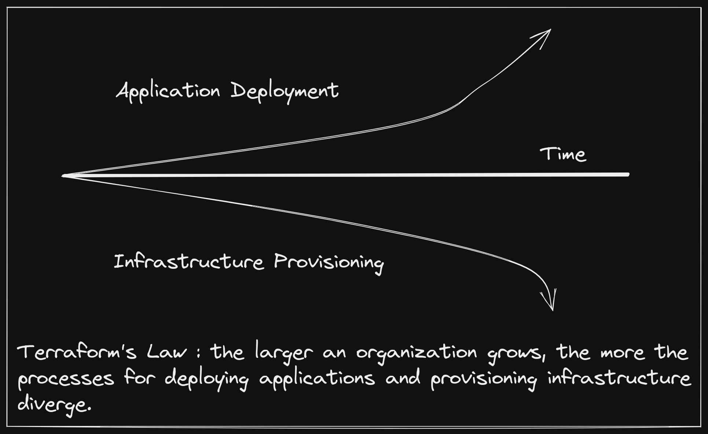

+++ 
draft = false
date = 2021-10-19T01:41:34-06:00
title = "Infrastructure in Your Software Packages"
slug = "infrastructure-in-your-software-packages" 
tags = []
categories = []
+++

> This post explores what a future of shipping infrastructure alongside software
> may look like by detailing where we are today, and evaluating how the delivery
> of software has evolved over time. If you just want the big ideas, skip to the
> final section: [A New Kind of Software
> Marketplace](https://danielmangum.com/posts/infrastructure-in-your-software-packages#a-new-kind-of-software-marketplace).

Almost all software depends on infrastructure. Installation documentation
typically has a section detailing how to run with your favorite cloud provider
managed services, and, if you're lucky, may even include a script to provision
that infrastructure for you. The best documentation makes the process of
initially setting up the required infrastructure relatively painless, but will
still fall short of ongoing management, upgrade, and migration of that
infrastructure.

Software itself used to also be more like this: easy to install, but hard to
keep running. Kubernetes has done a lot to improve this story by creating a
common application deployment target API that vendors can rely on to keep their
software running in a customer environment. Primitives and interfaces that
Kubernetes provides around networking, storage, and runtimes mean that a single
bundle of software can run effectively on heterogenous clusters.

However, as soon as you take one step outside of the Kubernetes API, this
operational nirvana begins to break down. Disparate processes for deploying your
software and provisioning the external infrastructure it relies on evolve
independently, and a simple setup like connecting an application to a managed
database service becomes cumbersome. Many have tried to bridge this gap by also
deploying their infrastructure as workloads within the Kubernetes cluster. The
problem is, when we do this we throw away more than two decades of work that
cloud providers have done to run managed infrastructure with absurd levels of
reliability and minimal burden on the consumer.



> This is not a shot at Terraform, but rather an acknowledgement of a common
> trend in most organizations, with Terraform being the most widely adopted and
> successful tool in the infrastructure provisioning space over the last decade.

This leaves us between a rock and a hard place where we must choose to divorce
our infrastructure management from the management of applications that consume
them or we must take on the relatively colossal effort of running the
infrastructure ourselves.

## Dynamically Linked Infrastructure

The relationship between software products and their infrastructure dependencies
today feels not so different from dynamically linked binaries, a practice we
have [started to move away
from](https://gavinhoward.com/2021/10/static-linking-considered-harmful-considered-harmful/)
as an industry. Though static linking is perhaps more prevalent than it once
was, dynamic linking still has some real advantages, some of which include:

- Smaller binaries (space)
- Ability to upgrade a dependency once for all dependents (security)
- No need to recompile a binary after dependency upgrade (time)

For these advantages to not be completely mitigated by the potential of
encountering [dependency hell](https://en.wikipedia.org/wiki/Dependency_hell),
there needs to be a strong API contract between the application and its
dynamically linked libraries.

> I am not a dynamic linking advocate when it comes to software, but, like
> almost any strategy, there is a time and place for it.

Static and dynamic linking of binaries deals with a choice between _build time_
and _run time_. When working with software packaging, we distinguish between
_package time_ and _deploy time_. Though not exact parallels, these stages share
similar properties, particularly that deferring to _run time_ and _deploy time_
generally provides more flexibility to the consumer, and, in turn, more
opportunity to make mistakes. One of the reasons we have moved towards
statically linked binaries is the general sentiment that the builder has more
domain expertise than the consumer. This is not necessarily true for
infrastructure, where provisioning steps are highly dependent on an
organization's unique environments, and software consumers have more context
than builders. This is one reason why we use more of a "dynamically linked"
approach in this realm.

Another is that the the API contracts between software and infrastructure are
mostly established and well-defined. These APIs typically come in the form of
protocols, such as MySQL, which enables consumer choice between a wide variety
of managed services, such as [RDS](https://aws.amazon.com/rds/) and
[CloudSQL](https://cloud.google.com/sql). Most would agree this works fairly
well, and moving to a more "statically linked" approach, such as shipping a full
database alongside an application would be a bad idea. When it comes to
infrastructure dependencies, the benefits of dynamic linking - smaller packages,
the ability to independently upgrade infrastructure, and no requirement
(usually) to repackage software due to infrastructure changes - feel like the
right tradeoffs.

Unfortunately, the way we link software to its infrastructure dependencies
doesn't explicitly declare a relationship like the undefined symbols in a
dynamically linked binary do. Instead, we manually document requirements, try to
give helpful error messages, or fly someone across the country to a company's
headquarters to help them setup their environments for the software.

While statically linked infrastructure does not make sense, we can move towards
another packaging goal: completeness. When software is downloaded, it should
contain or require everything it needs to run, and if it doesn't, it should let
you know as early as possible. A complete package moves us from **failing while
running the software** to **failing while deploying the software**.

The provisioning process for software infrastructure dependencies today
encompasses few of these traits. Because the dependant software is totally
unaware of the infrastructure provisioning process, it will, at best, proceed
until it is unable to function, and, at worst, proceed and function incorrectly.
For most of the history of packaged software this has been unavoidable.
Infrastructure environments are far too differentiated between organizations for
it to be feasible for a vendor to distribute dedicated packages for each.

So what options does this leave us? Fortunately, a movement toward internal
control planes, first popularized by the hyper-scalers, is starting to permeate
technology organizations. In the first part of this post, we talked about how
Kubernetes has automated many aspects of workload operations. In a way,
packaging software as a Helm chart, or other Kubernetes manifest bundle, has
allowed us to dynamically link software deployment machinery by creating a
ubiquitous API, which papers over the heterogenous underlying nodes, network
topology, etc. Using Kubernetes within an organization means that your software
packages can be delivered as more complete units - not just ready to run, but
ready to be scaled, upgraded, and connected.

We have moved closer to completeness, but the question of infrastructure
provisioning remains unanswered. However, Kubernetes' extension mechanisms have
rapidly turned it into more than just a workload orchestrator - it has become a
distributed systems framework, ripe for building control planes on top of. If we
can extend the API to include infrastructure, we can use the same packaging,
CI/CD systems, and development tooling to produce complete software packages.

A naive approach would be to take external APIs, let's stick with RDS for now,
and represent it as a Kubernetes API object. This may work for some
organizations, but package builders would need to produce an "our software with
RDS" package, and an "our software with CloudSQL" package, and so on. It would
be akin to Kubernetes exposing separate API objects for `LinuxAMD64Node`,
`LinuxARM64Node`, etc.

A more robust strategy would be to follow Kubernetes convention and expose
interfaces, for which there may be many implementations. Going one step further
would be to allow for package builders to define the interface themselves, and
potentially ship a few common implementations of that interface alongside their
software. This would result in a package that, when deployed, would ensure the
necessary infrastructure dependencies were in place, yet leave the granular
configuration and policy to the consumer.

## Crossplane: The Control Plane Framework

If Kubernetes has becomes the de facto distributed system framework, then
[Crossplane](https://crossplane.io/) is aiming to be the control plane framework
built on top of it. Crossplane is comprised of three major concepts, which
enable the packaging story described in the preceding section:

- **Managed Resources**: these are Kubernetes API objects that represent
  external infrastructure APIs with 1:1 fidelity. Examples include
  `EC2Instance`, `GKECluster`, `CosmosDB`, etc.
- **Composition**: this allows for defining new higher-level interfaces, as well
  as the _composition_ of managed resources that implement an interface.
  Interfaces are defined using a `CompositeResourceDefinition` (XRD), and
  implementations are defined using a `Composition`. As you might guess, there
  may be an arbitrary number of `Compositions` for any one XRD. The inner
  workings of composition machinery is described more completely in a [previous
  post](https://danielmangum.com/posts/crossplane-infrastructure-llvm/#crossplane---explained-by-a-human).
- **Packages**: these are different than the software packages that we have been
  discussing. They are the mechanisms for building a control plane, which,
  defined broadly, is a [directed acyclic graph
  (DAG)](https://en.wikipedia.org/wiki/Directed_acyclic_graph) of Crossplane
  packages. There are two types of Crossplane packages: `Providers` and
  `Configurations`.

An organization may start building their control plane by defining a single
`Configuration` package. Let's say developers need to be able to self-service
databases. The platform team may author a `Database` XRD, which only exposes the
fields they want developers to be able to configure.

> [Holy moly that's a lot of YAML!](https://youtu.be/ry3w5vx6GpQ?t=12) I get it,
> the Kubernetes ecosystem is rife with walls of YAML. We are working on tooling
> to reduce the strain on Crossplane users authoring these resources. Stay
> tuned!

```yaml
apiVersion: apiextensions.crossplane.io/v1
kind: CompositeResourceDefinition
metadata:
  name: xdatabases.example.org
spec:
  group: example.org
  names:
    kind: XDatabase
    plural: xdatabase
  claimNames:
    kind: Database
    plural: databases
  connectionSecretKeys:
    - username
    - password
    - endpoint
    - port
  versions:
  - name: v1alpha1
    served: true
    referenceable: true
    schema:
      openAPIV3Schema:
        type: object
        properties:
          spec:
            type: object
            properties:
              parameters:
                type: object
                properties:
                  storageGB:
                    type: integer
                required:
                  - storageGB
            required:
              - parameters
```

Then they will author one or more `Compositions` that dictate what
infrastructure is provisioned and how the configured fields on the `Database`
modify it.

```yaml
apiVersion: apiextensions.crossplane.io/v1
kind: Composition
metadata:
  name: database.aws.example.org
  labels:
    provider: aws
spec:
  writeConnectionSecretsToNamespace: crossplane-system
  compositeTypeRef:
    apiVersion: example.org/v1alpha1
    kind: XDatabase
  resources:
    - name: rdsinstance
      base:
        apiVersion: database.aws.crossplane.io/v1beta1
        kind: RDSInstance
        spec:
          forProvider:
            region: us-east-1
            dbInstanceClass: db.t2.small
            masterUsername: masteruser
            engine: postgres
            engineVersion: "12"
            skipFinalSnapshotBeforeDeletion: true
            publiclyAccessible: true
          writeConnectionSecretToRef:
            namespace: crossplane-system
      patches:
        - fromFieldPath: "metadata.uid"
          toFieldPath: "spec.writeConnectionSecretToRef.name"
          transforms:
            - type: string
              string:
                fmt: "%s-postgresql"
        - fromFieldPath: "spec.parameters.storageGB"
          toFieldPath: "spec.forProvider.allocatedStorage"
      connectionDetails:
        - fromConnectionSecretKey: username
        - fromConnectionSecretKey: password
        - fromConnectionSecretKey: endpoint
        - fromConnectionSecretKey: port
```

> This `Composition` only composes a single resource (`RDSInstance`), but an
> arbitrary number of resources may be included in a single `Composition`.

Lastly, they will bundle the XRD and the `Composition` into a `Configuration`
package, defining any dependencies on other packages. For instance, the
`Composition` above provisions resources on AWS, so the `Configuration` package
should declare a dependency on the AWS `Provider` package.

```yaml
apiVersion: meta.pkg.crossplane.io/v1
kind: Configuration
metadata:
  name: MyDatabasePkg
spec:
  crossplane:
    version: ">=v1.0.0-0"
  dependsOn:
    - provider: crossplane/provider-aws
      version: ">=v0.19.0"
```

The `Configuration` package is bundled as an OCI image that can be hosted on any
registry, and when it is [installed into a Kubernetes
cluster](https://crossplane.io/docs/v1.4/concepts/packages.html#installing-a-package)
with Crossplane present, Crossplane will ensure that all dependencies are
installed and configured. From that point forward, a `Database` object can be
created in the cluster, and the infrastructure defined in the `Composition` will
be provisioned. If multiple `Compositions` are defined, one can be optionally
selected as a parameter to the `Database` object.

```yaml
apiVersion: example.org/v1alpha1
kind: Database
metadata:
  name: my-db
  namespace: default
spec:
  parameters:
    storageGB: 20
  compositionSelector:
    matchLabels:
      provider: aws
  writeConnectionSecretToRef:
    name: db-conn
```

At this point, the organization control plane looks like this:


Now when a developer goes to create and deploy their application Helm chart,
they don't ask for the platform team to create a database and a `Secret` for
them to consume. They add a `Database` to their chart and it gets deployed
alongside their software, only giving them the knobs to turn that the platform
team has blessed.

> Let the record show that I don't actually recommend doling out infrastructure
> credentials via Kubernetes `Secrets`, but, ya know, it happens.

This is a powerful concept, especially when you consider that the high-level
`Database` type itself can be included as a resource in a `Composition` for an
even higher-level XRD. Over time, an organization can continue to build out its
control plane by composing infrastructure and exposing it at various levels of
abstraction.


> Each of the packages in the control plane above could be installed
> individually, in which case Crossplane's package manager would ensure that
> valid dependencies exist and that the graph contains no cycles. However, a
> recommended strategy is to install a single, top-level "root package", which
> contains no XRDs or `Compositions`, but declares the first level of
> dependencies. This allows Crossplane to manage dependencies, all of which
> become ancestors of the root package, and upgrades can be managed from a
> single location.

## An Opportunity for Software Vendors

Working at a company that sells enterprise software, I can tell you firsthand
that integrating a complex product into a customer environment can be time
consuming and error prone. The difficulty arises from the fact that the builder
knows best what kind of infrastructure the software requires, and the customer
knows best how to provision infrastructure in their environment. This usually
leads to the vendor requiring the lowest common denominator for infrastructure,
and the customer trying and failing to set up the proper infrastructure a number
of times, before eventually succeeding and getting something working, only to
find out in a few months that it is not suitable for the workload.

In a world of dynamically linked infrastructure, vendors can instead require
infrastructure as part of their software packages. Let's say a vendor has an
application that requires a MySQL database. They may author a `Configuration`
package with the following contents:

- An XRD named `VendorSoftware`
- A `Composition` for `VendorSoftware` which includes a Helm `Release` and
  `VendorSoftwareDB`
- An XRD named `VendorSoftwareDB`
- A `Composition` for `VendorSoftwareDB` which includes a GCP `CloudSQLInstance`
- Dependencies on the [GCP](https://github.com/crossplane/provider-gcp) and
  [Helm](https://github.com/crossplane-contrib/provider-helm) `Providers`


> Earlier we talked about including an XRD-defined resource in a Helm chart to
> provision infrastructure alongside our software. Here we are bundling a Helm
> chart in a `Composition` (via the Helm `Release` resource) alongside its
> infrastructure (`VendorSoftwareDB`). It can be confusing when determining how
> to deploy software when both of these options are available, but here we are
> treating the vendor software as part of our organization control plane, rather
> than software that consumes from it. This can be a good general rule of thumb
> when using Crossplane packages: if you are adding a new API to your control
> plane (as we are doing here), bundle the software in your Crossplane package.
> If you are consuming an API from your control plane, bundle the infrastructure
> in your software package.

There are a number of interesting patterns going on here, but one of note is the
fact that we define a separate XRD and `Composition` for `VendorSoftwareDB`,
rather than just including the `CloudSQLInstance` in the `VendorSoftware`
`Composition` directly. The reason is that the consumer now has an an
_intermediate interface_ for the database infrastructure required by
`VendorSoftware`, thus enabling them to optionally define their own
implementation. If they are happy to provision a CloudSQL instance on GCP, they
only need to create a `VendorSoftware` instance and they get a vendor-tested
infrastructure configuration without any manual intervention. If they want to
supply their own `VendorSoftwareDB` compatible `Composition`, they can opt to
use it, while still provisioning it via the top-level `VendorSoftware` type.


Furthermore, they can add to the `VendorSoftware` by including it in a
`Composition` for a higher-level XRD. This can be especially useful in the case
that additional infrastructure needs to be provisioned every time an instance of
the software is deployed (e.g. custom firewall rules, DNS entries, etc.).


## A New Kind of Software Marketplace

So where does this leave us? In my mind, it is a fundamental reshaping of how we
integrate new software into an organization. It is a vision of a world where
taking a dependency on an enterprise product is quite literally just updating
the list of dependencies in your control plane. It is an ecosystem and
marketplace where large and small organizations can identify a need, find the
best solution, and integrate it in days rather than months or years.

This model has a number of benefits outside of just improving time to deploy.
For instance, when infrastructure is included in software packages, auditing
those packages for security and compliance becomes easier. In a new software
marketplace, vendors can have their packages pre-certified for standards such as
[FIPS](https://en.wikipedia.org/wiki/FIPS_140-2) and
[HIPPA](https://en.wikipedia.org/wiki/Health_Insurance_Portability_and_Accountability_Act).
They can also offer multiple variations, giving consumers options such as
"simple setup" and "globally distributed, production-ready deployment".

Just like how GitHub has facilitated an ecosystem where organizations can
consume software and contribute back, this new marketplace will provide the same
opportunities for control plane components. For example, if a vendor offers a
package that supports provisioning AWS infrastructure alongside their software,
a consumer can take that package and either fork it or wrap it with support for
GCP.

Likewise, vendor collaboration and integration becomes drastically easier. If I
provide software that depends on a database, and you provide a database
solution, you can take my package and add an implementation that relies on your
product, then publish it for users to consume.

We most certainly have not arrived at this future though. While the primitives
are established, tooling, specifications, and most importantly a community of
builders and users are still growing and maturing. It takes a village, and all
are welcome!

Send me a message [@hasheddan](https://twitter.com/hasheddan) on Twitter with
any questions or comments!
