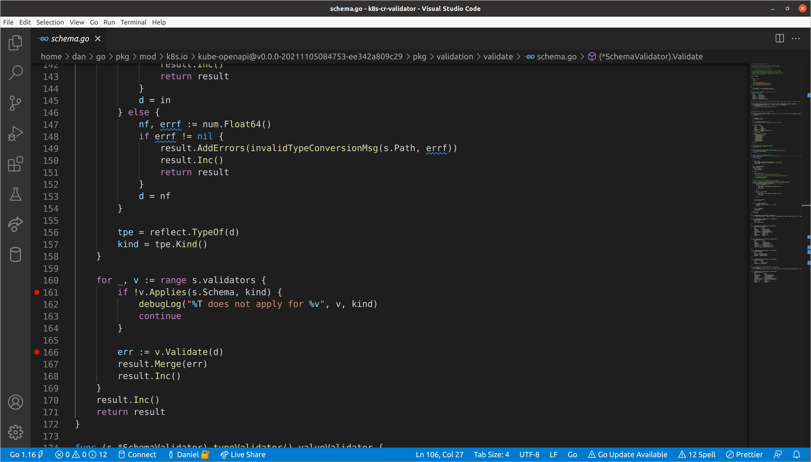
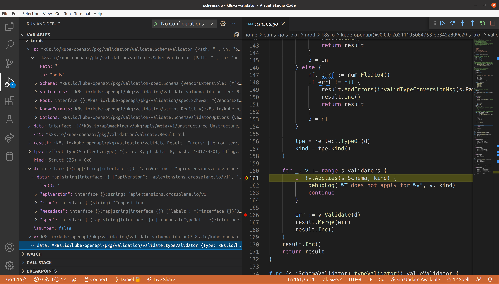
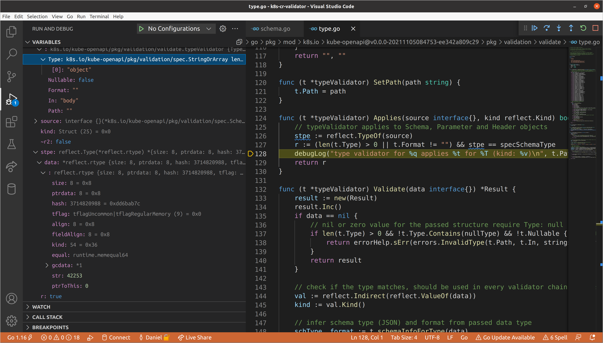
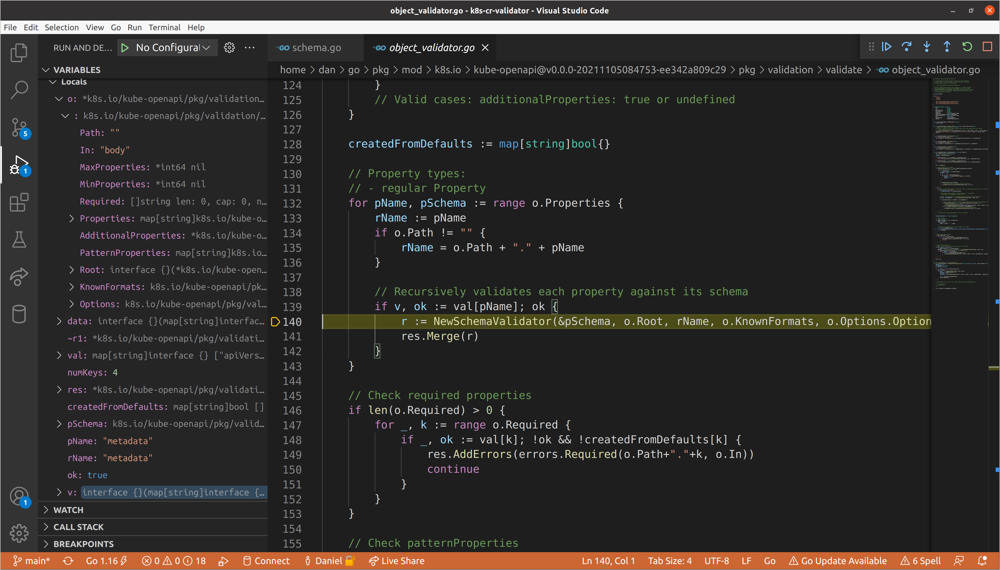
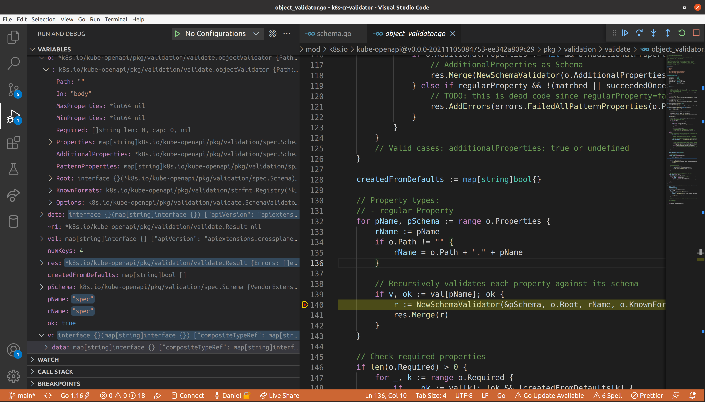
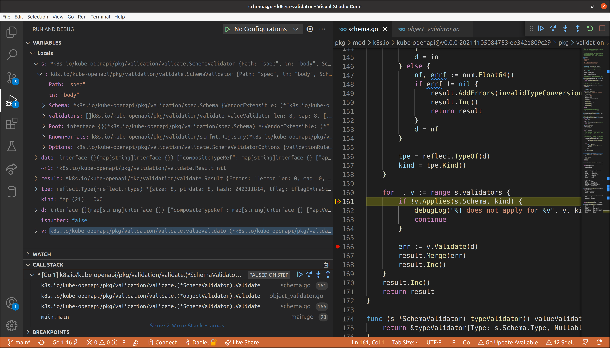
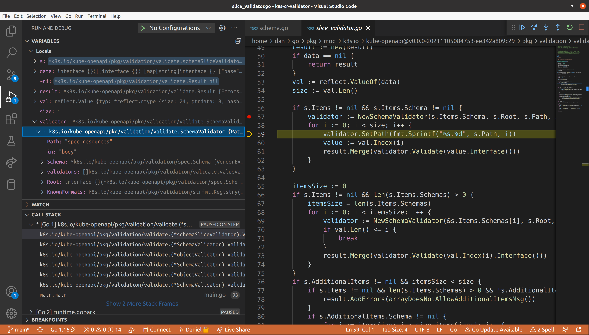
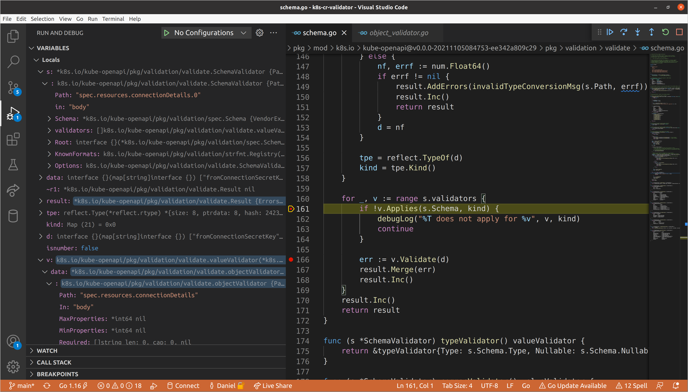
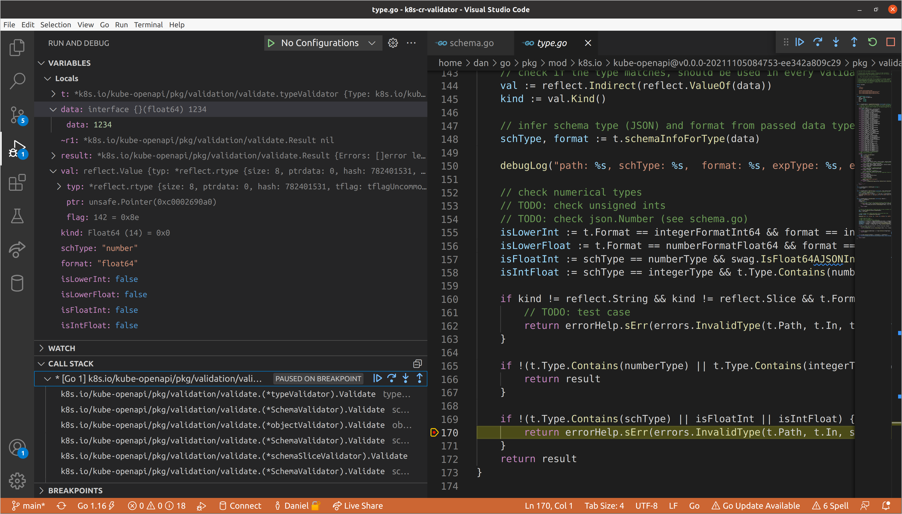

+++ 
draft = false
date = 2021-11-08T01:41:34-06:00
title = "How Kubernetes Validates Custom Resources"
slug = "how-kubernetes-validates-custom-resources"
tags = []
categories = []
+++

> This post references the Kubernetes codebase at commit
> [d92a443ca7](https://github.com/kubernetes/kubernetes/tree/d92a443ca7867e0d2c1047b0502a7da42f1ac5e7)
> and [kube-openapi](https://github.com/kubernetes/kube-openapi) at commit
> [ee342a809c](https://github.com/kubernetes/kube-openapi/tree/ee342a809c29ce286ab48cea8442ef9cd0ab8c1c),
> but should remain mostly applicable for an extended period of time barring any
> massive refactor to Kubernetes internals. This is also intended to be a very
> active read and a reference to come back to over time. There are **a lot** of
> links to source code that is not embedded because the post would have become
> even more unwieldy than it already is. That being said, I have attempted to
> make it possible to glean most of the information around the main topic
> without needing to leave the page.

A few days ago [I
asked](https://twitter.com/hasheddan/status/1456349844612784134?s=20) if folks
would find a post about how Kubernetes validates resources against their schemas
useful. This topic is of particular interest to me because it requires peeling
back a number of layers of abstraction before we reach the actual logic we care
about. That being said, not everyone wants, or has time to go through every step
in the [control flow graph](https://en.wikipedia.org/wiki/Control-flow_graph) of
a program, so while this post includes details about why and how we get to
validating custom resources, I have provided a few different options for how you
can go about extracting the exact information you want.

**Options for Reading This Post**
- _"Give me all the words!"_ - Go right ahead to the [next
  section](https://danielmangum.com/posts/how-kubernetes-validates-custom-resources#a-big-idea).
  You have been warned.
- _"I don't care about your life story."_ - Harsh, but fair. Skip to [A Starting
  Point](https://danielmangum.com/posts/how-kubernetes-validates-custom-resources#a-starting-point).
- _"If it's not answering the title of this post, I don't want it."_ - If you
  are primarily interested in the literal validation, rather than when it is
  invoked, skip to [Performing
  Validation](https://danielmangum.com/posts/how-kubernetes-validates-custom-resources#performing-validation).
- _"I need to validate a custom resource, I don't care how it works."_ - If you
  just want to know how you can perform offline validation with the same
  machinery used in upstream Kubernetes, head on over to the [minimal
  example](https://github.com/hasheddan/k8s-cr-validator) we use later on in
  this post.
- _"This looks long and boring."_ - [Send me a
  message](https://twitter.com/hasheddan)! I am more than happy to join your
  livesteam, podcast, or just jump on Zoom call.


## A Big Idea

This all began because early Kubernetes creators / contributors noticed that
this system designed for scheduling containerized workloads could support other
use-cases, and naturally began to theorize about the feasibility of a plugin
model. Luckily, if you look hard enough, you can find all of these conversations
and how the design changed over time. This was long before Kubernetes
Enhancement Proposals (KEPs) were a thing, but when the
`CustomResourceDefinition` (CRD) KEP was [retroactively
added](https://github.com/kubernetes/enhancements/pull/833), Brian Grant
aggregated some of those [initial issues and design
docs](https://github.com/kubernetes/enhancements/pull/833#issuecomment-463909259),
as well as the [first RFC for
`ThirdPartyResources`](https://github.com/kubernetes/kubernetes/pull/11781) (the
predecessor to `CustomResourceDefinitions`).

So what is different about these resources than the rest of the "built-in" API
types? Well most importantly, Kubernetes doesn't learn about their existence
until runtime. That means that the [API
Server](https://kubernetes.io/docs/reference/command-line-tools-reference/kube-apiserver/)
must be informed of the name and structure of the new types, then dynamically
start serving endpoints that validate and store instances of those types.
[`CustomResourceDefinition`](https://kubernetes.io/docs/concepts/extend-kubernetes/api-extension/custom-resources/#customresourcedefinitions)
is the built-in Kubernetes API type that is used to communicate the definition
of these new types to the API Server. You can think of creating a CRD as
analogous to defining a new type in your favorite programming language. 

Most folks familiar with Kubernetes use CRDs in some form or fashion, whether it
be [to provision infrastructure](https://crossplane.io/), [manage
certificates](https://cert-manager.io/), or a whole host of other operations. At
this point, they are a critical component of the Kubernetes ecosystem.

## A Startling Realization

I am typically someone who likes to know _exactly_ how almost everything works.
I don't mean conceptually how it works; I want to know literally the exact
operations that are performed in response to any event. Honestly, this is a bit
of a problem. You don't always have time to investigate the depths of what is
happening behind every layer of abstraction (though that does sound like some
sort of nirvana to me), and it is often the correct engineering decision to
critically evaluate the reliability of a system, then accept the interface that
it provides as your entry point.

Sometimes we can't help ourselves though, and this week was one of those weeks
for me. It was mostly triggered by a few issues we ran into with
[Crossplane](https://github.com/crossplane/crossplane). The first thing you
should know is that we _really_ like CRDs in Crossplane. So much so that we
realized that we might like them even [more that the API Server can
handle](https://github.com/crossplane/crossplane/issues/2649). Some members of
the Crossplane community (who also happen to be some of my wonderful coworkers
at [Upbound](https://www.upbound.io/)) have been working on auto-generating
Providers for all major cloud providers, meaning that we suddenly have packages
that install 700+ CRDs, and it turns out the API Server can get pretty upset
about that. Those folks ran through some [fairly extensive
testing](https://github.com/kubernetes/kubernetes/issues/105932) to evaluate
what was going on here, which resulted in identifying that the bottleneck was
due to the API Server recomputing the entire merged
[OpenAPI](https://www.openapis.org/) schema on every CRD install. Fortunately,
there was already work in progress to [make this process
lazy](https://github.com/kubernetes/kube-openapi/pull/251), which has now been
merged thanks to some great collaboration with upstream contributors and
maintainers!

However, that wasn't the primary thing that piqued my interest as I was not
extensively involved with that investigation (I am hoping one of the folks who
was will write up a detailed post about how they tested and identified the
issue!). I was working on a separate effort that involves offline validation of
custom resources, so I happened to be navigating the
[kube-openapi](https://github.com/kubernetes/kube-openapi) codebase as well.
Through doing so, I came to a startling realization: I don't know what is going
on. Despite dedicating quite a bit of time to contributing to Kubernetes itself,
and even more time working on Crossplane, which is tightly coupled to much of
this machinery, if you asked me to describe exactly what goes on when you
install a CRD and subsequently create custom resource definitions of the type
that it defines, I would have to get back to you on that.

Now, this alone is certainly not reason to write this blog post, which is
already getting fairly long before even getting through the background context.
A more compelling reason perhaps is that I also discovered that it appears that
very few other people know _exactly_ what is going on here. And it's for good
reason! While spelunking my way through the codebase, I discovered [this
PR](https://github.com/kubernetes/kube-openapi/pull/214), which adds an `OWNERS`
file to the kube-openapi `validation` package, in which
[@sttts](https://github.com/sttts) accurately asserts:

> "This code is sensitive because it is both reasonable complex and has
> influence on the API. Hence, we add an OWNERS file to restrict the set of
> people as reviewers+approvers who are deeply familiar with the validation
> logic."

Well said. This logic is critical to ensuring that the Kubernetes API actually
behaves as defined. I found myself needing to understand this, and I believe it
is a net win for everyone if it more accessible to others as well. So here we
go...

## A Starting Point

Before we get into the actual validation logic, we need to understand where it
is being called from. `CustomResourceDefinitions` are managed by the [API
Extensions API
Server](https://github.com/kubernetes/kubernetes/tree/d92a443ca7/staging/src/k8s.io/apiextensions-apiserver),
which gets [bundled into the Kube API
Server](https://github.com/kubernetes/kubernetes/blob/d92a443ca7/cmd/kube-apiserver/app/server.go#L201)
via chaining. This
[server](https://github.com/kubernetes/kubernetes/blob/d92a443ca7/staging/src/k8s.io/apiextensions-apiserver/pkg/apiserver/apiserver.go#L130)
is responsible for serving handlers for both [`CustomResourceDefinitions`
themselves](https://github.com/kubernetes/kubernetes/blob/d92a443ca7867e0d2c1047b0502a7da42f1ac5e7/staging/src/k8s.io/apiextensions-apiserver/pkg/apiserver/apiserver.go#L162)
and the [new
types](https://github.com/kubernetes/kubernetes/blob/d92a443ca7/staging/src/k8s.io/apiextensions-apiserver/pkg/apiserver/apiserver.go#L188)
they define.

> Chaining of API servers is an incredibly interesting topic in its own right,
> which, out of respect for your time, I will not cover extensively in this
> post. However, I do promise to write a deep dive post on it in the future. In
> the mean time, I encourage you to take a look at the construction of a
> [GenericAPIServer](https://github.com/kubernetes/kubernetes/blob/d92a443ca7/staging/src/k8s.io/apiserver/pkg/server/config.go#L567),
> and the
> [apiserver](https://github.com/kubernetes/kubernetes/tree/d92a443ca7/staging/src/k8s.io/apiserver)
> project in general. The Kubernetes API server is actually a chain of the [API
> Extensions API
> Server](https://github.com/kubernetes/kubernetes/blob/d92a443ca7/staging/src/k8s.io/apiextensions-apiserver/pkg/apiserver/apiserver.go#L104),
> the [Kube API
> Server](https://github.com/kubernetes/kubernetes/blob/d92a443ca7/pkg/controlplane/instance.go#L235),
> and the [Kube Aggregator API
> Server](https://github.com/kubernetes/kubernetes/blob/d92a443ca7/staging/src/k8s.io/kube-aggregator/pkg/apiserver/apiserver.go#L117),
> all of which use the generic API server under the hood. 

The create / update / delete operations of a CRD itself is of less interest to
us in this post, but to indulge the curious, the generic API server presents a
[`Storage`
interface](https://github.com/kubernetes/kubernetes/blob/d92a443ca7/staging/src/k8s.io/apiserver/pkg/registry/rest/rest.go#L55),
which is required for any resources that are added as RESTful services. Prior to
installing the [CRD API
group](https://github.com/kubernetes/kubernetes/blob/d92a443ca7867e0d2c1047b0502a7da42f1ac5e7/staging/src/k8s.io/apiextensions-apiserver/pkg/apiserver/apiserver.go#L162),
we
[instantiate](https://github.com/kubernetes/kubernetes/blob/d92a443ca7867e0d2c1047b0502a7da42f1ac5e7/staging/src/k8s.io/apiextensions-apiserver/pkg/apiserver/apiserver.go#L152)
its [implementation of the
interface](https://github.com/kubernetes/kubernetes/blob/d92a443ca7867e0d2c1047b0502a7da42f1ac5e7/staging/src/k8s.io/apiextensions-apiserver/pkg/registry/customresourcedefinition/etcd.go#L42),
then add it to the group's [`VersionedResourcesStorageMap` for the `v1`
version](https://github.com/kubernetes/kubernetes/blob/d92a443ca7867e0d2c1047b0502a7da42f1ac5e7/staging/src/k8s.io/apiextensions-apiserver/pkg/apiserver/apiserver.go#L157)
(`v1` is now the only supported as `v1beta1` was [removed in the recent 1.22
release](https://kubernetes.io/docs/reference/using-api/deprecation-guide/#customresourcedefinition-v122)).
When we then call `InstallAPIGroup()`, we eventually get to [`InstallREST()` in
the generic API
server](https://github.com/kubernetes/kubernetes/blob/d92a443ca7867e0d2c1047b0502a7da42f1ac5e7/staging/src/k8s.io/apiserver/pkg/server/genericapiserver.go#L548),
which [constructs an
`APIInstaller`](https://github.com/kubernetes/kubernetes/blob/d92a443ca7867e0d2c1047b0502a7da42f1ac5e7/staging/src/k8s.io/apiserver/pkg/endpoints/groupversion.go#L110)
that is [used to
`Install()`](https://github.com/kubernetes/kubernetes/blob/d92a443ca7867e0d2c1047b0502a7da42f1ac5e7/staging/src/k8s.io/apiserver/pkg/endpoints/installer.go#L99)
a new
[webservice](https://github.com/kubernetes/kubernetes/blob/d92a443ca7867e0d2c1047b0502a7da42f1ac5e7/vendor/github.com/emicklei/go-restful/web_service.go#L17),
which uses the underlying `Storage` implementation to [register resource
handlers](https://github.com/kubernetes/kubernetes/blob/d92a443ca7867e0d2c1047b0502a7da42f1ac5e7/staging/src/k8s.io/apiserver/pkg/endpoints/installer.go#L191).

So, yeah, some things are happening.

However, what we really want to see is how we are dealing with the custom
resources that we are defining the schema of using a CRD. Fortunately, the
generic API server also allows you to register arbitrary additional handlers in
the chain [using
`NonGoRestfulMux`](https://github.com/kubernetes/kubernetes/blob/d92a443ca7867e0d2c1047b0502a7da42f1ac5e7/staging/src/k8s.io/apiserver/pkg/server/handler.go#L51).
After we [construct our
`CustomResourceDefinitionHandler`](https://github.com/kubernetes/kubernetes/blob/d92a443ca7867e0d2c1047b0502a7da42f1ac5e7/staging/src/k8s.io/apiextensions-apiserver/pkg/apiserver/apiserver.go#L188),
this is [exactly what we
do](https://github.com/kubernetes/kubernetes/blob/d92a443ca7867e0d2c1047b0502a7da42f1ac5e7/staging/src/k8s.io/apiextensions-apiserver/pkg/apiserver/apiserver.go#L208).

> This post is also not about the API Extensions API Server, though it feels
> wrong to not mention that besides registering REST handlers for CRDs and the
> custom resources they define, it also [runs a few critical
> controllers](https://github.com/kubernetes/kubernetes/blob/d92a443ca7867e0d2c1047b0502a7da42f1ac5e7/staging/src/k8s.io/apiextensions-apiserver/pkg/apiserver/apiserver.go#L204)
> that are responsible for operations such as [reserving
> names](https://github.com/kubernetes/kubernetes/blob/d92a443ca7867e0d2c1047b0502a7da42f1ac5e7/staging/src/k8s.io/apiextensions-apiserver/pkg/controller/status/naming_controller.go#L48)
> and [populating discovery
> caches](https://github.com/kubernetes/kubernetes/blob/d92a443ca7867e0d2c1047b0502a7da42f1ac5e7/staging/src/k8s.io/apiextensions-apiserver/pkg/apiserver/customresource_discovery_controller.go#L43).

## Handling Requests

[The
`CustomResourceDefinitionHandler`](https://github.com/kubernetes/kubernetes/blob/d92a443ca7867e0d2c1047b0502a7da42f1ac5e7/staging/src/k8s.io/apiextensions-apiserver/pkg/apiserver/customresource_handler.go#L95)
is really where all of the interesting logic around dealing with custom
resources resides. If you have ever worked with HTTP servers using Go, you are
likely familiar with the [`ServeHTTP` method
signature](https://pkg.go.dev/net/http#HandlerFunc.ServeHTTP), which allows a
type to act as [a `HandlerFunc`](https://pkg.go.dev/net/http#HandlerFunc). In
the [CRD handler `ServeHTTP`
method](https://github.com/kubernetes/kubernetes/blob/d92a443ca7867e0d2c1047b0502a7da42f1ac5e7/staging/src/k8s.io/apiextensions-apiserver/pkg/apiserver/customresource_handler.go#L234),
we start off by [parsing the
request](https://github.com/kubernetes/kubernetes/blob/d92a443ca7867e0d2c1047b0502a7da42f1ac5e7/staging/src/k8s.io/apiextensions-apiserver/pkg/apiserver/customresource_handler.go#L236)
and [evaluating whether it is a resource
request](https://github.com/kubernetes/kubernetes/blob/d92a443ca7867e0d2c1047b0502a7da42f1ac5e7/staging/src/k8s.io/apiextensions-apiserver/pkg/apiserver/customresource_handler.go#L244).
If it is not, we either pass it along to [the
`versionDiscoverHandler`](https://github.com/kubernetes/kubernetes/blob/d92a443ca7867e0d2c1047b0502a7da42f1ac5e7/staging/src/k8s.io/apiextensions-apiserver/pkg/apiserver/customresource_discovery.go#L28),
[the
`groupDiscoverHandler`](https://github.com/kubernetes/kubernetes/blob/d92a443ca7867e0d2c1047b0502a7da42f1ac5e7/staging/src/k8s.io/apiextensions-apiserver/pkg/apiserver/customresource_handler.go#L252),
or, if it does not match paths for either one of those handlers, we pass it
along to the delegate API server.

Source:
[`apiextensions-apiserver/pkg/apiserver/customresource_handler.go#L242`](https://github.com/kubernetes/kubernetes/blob/d92a443ca7867e0d2c1047b0502a7da42f1ac5e7/staging/src/k8s.io/apiextensions-apiserver/pkg/apiserver/customresource_handler.go#L242)
```go
    if !requestInfo.IsResourceRequest {
        pathParts := splitPath(requestInfo.Path)
        // only match /apis/<group>/<version>
        // only registered under /apis
        if len(pathParts) == 3 {
            if !r.hasSynced() {
                responsewriters.ErrorNegotiated(serverStartingError(), Codecs, schema.GroupVersion{Group: requestInfo.APIGroup, Version: requestInfo.APIVersion}, w, req)
                return
            }
            r.versionDiscoveryHandler.ServeHTTP(w, req)
            return
        }
        // only match /apis/<group>
        if len(pathParts) == 2 {
            if !r.hasSynced() {
                responsewriters.ErrorNegotiated(serverStartingError(), Codecs, schema.GroupVersion{Group: requestInfo.APIGroup, Version: requestInfo.APIVersion}, w, req)
                return
            }
            r.groupDiscoveryHandler.ServeHTTP(w, req)
            return
        }

        r.delegate.ServeHTTP(w, req)
        return
    }
```

You'll see this pattern of passing along to the delegate across servers that use
the generic API server. This is what allows the server chaining we discussed
earlier, though with the API Extensions API Server being last in the chain, its
delegate is just the [`notFound`
handler](https://github.com/kubernetes/kubernetes/blob/d92a443ca7867e0d2c1047b0502a7da42f1ac5e7/cmd/kube-apiserver/app/server.go#L200).

Next up, we need to get the CRD for the type of custom resource we are handling.
This accomplished by passing the name to [the
`crdLister`](https://github.com/kubernetes/kubernetes/blob/d92a443ca7867e0d2c1047b0502a7da42f1ac5e7/staging/src/k8s.io/apiextensions-apiserver/pkg/apiserver/customresource_handler.go#L106),
which is backed by [the
`CustomResourceDefinitionInformer`](https://github.com/kubernetes/kubernetes/blob/d92a443ca7867e0d2c1047b0502a7da42f1ac5e7/staging/src/k8s.io/apiextensions-apiserver/pkg/client/informers/externalversions/apiextensions/v1/customresourcedefinition.go#L37).
We constructed this informer in the API Extensions API Server instantiation and
[passed
it](https://github.com/kubernetes/kubernetes/blob/d92a443ca7867e0d2c1047b0502a7da42f1ac5e7/staging/src/k8s.io/apiextensions-apiserver/pkg/apiserver/apiserver.go#L184)
to the CRD handler. An interesting point to note here is that most folks are
familiar [with
`SharedInformers`](https://github.com/kubernetes/kubernetes/blob/d92a443ca7867e0d2c1047b0502a7da42f1ac5e7/staging/src/k8s.io/client-go/tools/cache/shared_informer.go#L34)
from building some sort of client that interacts with Kubernetes (e.g. an
external controller or CLI tool). However, in this case we are the server, so
[the
`clientset`](https://github.com/kubernetes/kubernetes/blob/d92a443ca7867e0d2c1047b0502a7da42f1ac5e7/staging/src/k8s.io/apiextensions-apiserver/pkg/client/clientset/clientset/clientset.go#L40)
we use is backed by [a
`LoopbackClientConfig`](https://github.com/kubernetes/kubernetes/blob/d92a443ca7867e0d2c1047b0502a7da42f1ac5e7/staging/src/k8s.io/apiextensions-apiserver/pkg/apiserver/apiserver.go#L166)
provided by the generic API server.

Next, we perform a [variety of
checks](https://github.com/kubernetes/kubernetes/blob/d92a443ca7867e0d2c1047b0502a7da42f1ac5e7/staging/src/k8s.io/apiextensions-apiserver/pkg/apiserver/customresource_handler.go#L277)
to ensure that the request is valid:

Source:
[`apiextensions-apiserver/pkg/apiserver/customresource_handler.go#L275`](https://github.com/kubernetes/kubernetes/blob/d92a443ca7867e0d2c1047b0502a7da42f1ac5e7/staging/src/k8s.io/apiextensions-apiserver/pkg/apiserver/customresource_handler.go#L275)
```go
    // if the scope in the CRD and the scope in request differ (with exception of the verbs in possiblyAcrossAllNamespacesVerbs
    // for namespaced resources), pass request to the delegate, which is supposed to lead to a 404.
    namespacedCRD, namespacedReq := crd.Spec.Scope == apiextensionsv1.NamespaceScoped, len(requestInfo.Namespace) > 0
    if !namespacedCRD && namespacedReq {
        r.delegate.ServeHTTP(w, req)
        return
    }
    if namespacedCRD && !namespacedReq && !possiblyAcrossAllNamespacesVerbs.Has(requestInfo.Verb) {
        r.delegate.ServeHTTP(w, req)
        return
    }

    if !apiextensionshelpers.HasServedCRDVersion(crd, requestInfo.APIVersion) {
        r.delegate.ServeHTTP(w, req)
        return
    }

    // There is a small chance that a CRD is being served because NamesAccepted condition is true,
    // but it becomes "unserved" because another names update leads to a conflict
    // and EstablishingController wasn't fast enough to put the CRD into the Established condition.
    // We accept this as the problem is small and self-healing.
    if !apiextensionshelpers.IsCRDConditionTrue(crd, apiextensionsv1.NamesAccepted) &&
        !apiextensionshelpers.IsCRDConditionTrue(crd, apiextensionsv1.Established) {
        r.delegate.ServeHTTP(w, req)
        return
    }
```

Assuming the request is valid, we now have to [fetch the serving information for
the
CRD](https://github.com/kubernetes/kubernetes/blob/d92a443ca7867e0d2c1047b0502a7da42f1ac5e7/staging/src/k8s.io/apiextensions-apiserver/pkg/apiserver/customresource_handler.go#L304)
that defines the custom resource type. This
[method](https://github.com/kubernetes/kubernetes/blob/d92a443ca7867e0d2c1047b0502a7da42f1ac5e7/staging/src/k8s.io/apiextensions-apiserver/pkg/apiserver/customresource_handler.go#L599)
accesses the handler's CRD storage map, which holds a [cache of serving
information for each
CRD](https://github.com/kubernetes/kubernetes/blob/d92a443ca7867e0d2c1047b0502a7da42f1ac5e7/staging/src/k8s.io/apiextensions-apiserver/pkg/apiserver/customresource_handler.go#L140).

> The [`customStorage`
> map](https://github.com/kubernetes/kubernetes/blob/d92a443ca7867e0d2c1047b0502a7da42f1ac5e7/staging/src/k8s.io/apiextensions-apiserver/pkg/apiserver/customresource_handler.go#L104)
> is implemented as [an `atomic.Value`](https://pkg.go.dev/sync/atomic#Value),
> which has [performance
> advantages](https://gist.github.com/dim/152e6bf80e1384ea72e17ac717a5000a) over
> a traditional [`RWMutex` approach](https://pkg.go.dev/sync#RWMutex) in
> read-heavy situations.

In the event that the CRD storage is present in the map, it is returned and we
proceed. However, if it is not, we have to first [acquire a write lock on the
map](https://github.com/kubernetes/kubernetes/blob/d92a443ca7867e0d2c1047b0502a7da42f1ac5e7/staging/src/k8s.io/apiextensions-apiserver/pkg/apiserver/customresource_handler.go#L605),
then construct all of the necessary information for the given CRD. There is a
lot that is going on here, but I want to particularly focus in on [constructing
the `validator` for each
version](https://github.com/kubernetes/kubernetes/blob/d92a443ca7867e0d2c1047b0502a7da42f1ac5e7/staging/src/k8s.io/apiextensions-apiserver/pkg/apiserver/customresource_handler.go#L733):

Source:
[`apiextensions-apiserver/pkg/apiserver/customresource_handler.go#L733`](https://github.com/kubernetes/kubernetes/blob/d92a443ca7867e0d2c1047b0502a7da42f1ac5e7/staging/src/k8s.io/apiextensions-apiserver/pkg/apiserver/customresource_handler.go#L733)
```go
        var internalValidationSchema *apiextensionsinternal.CustomResourceValidation
        if validationSchema != nil {
            internalValidationSchema = &apiextensionsinternal.CustomResourceValidation{}
            if err := apiextensionsv1.Convert_v1_CustomResourceValidation_To_apiextensions_CustomResourceValidation(validationSchema, internalValidationSchema, nil); err != nil {
                return nil, fmt.Errorf("failed to convert CRD validation to internal version: %v", err)
            }
        }
        validator, _, err := apiservervalidation.NewSchemaValidator(internalValidationSchema)
        if err != nil {
            return nil, err
        }
```

This `validator` is what will be used to ensure that all custom resources that
are created conform to the `openAPIV3Schema` defined in the CRD. It is [passed
to
`NewStrategy()`](https://github.com/kubernetes/kubernetes/blob/d92a443ca7867e0d2c1047b0502a7da42f1ac5e7/staging/src/k8s.io/apiextensions-apiserver/pkg/apiserver/customresource_handler.go#L793),
which is then [passed to
`NewStorage()`](https://github.com/kubernetes/kubernetes/blob/d92a443ca7867e0d2c1047b0502a7da42f1ac5e7/staging/src/k8s.io/apiextensions-apiserver/pkg/apiserver/customresource_handler.go#L789),
which then constructs an implementation of the `Storage` interface provided by
the generic API server, similarly to what we saw with installing the
`CustomResourceDefinition` API group earlier. There are a number of levels of
indirection here before the actual calling of the `validator`, but let's finish
out the handler before we get to that.

Now that we have the serving information for the CRD, we can [evaluate what type
of request is being
made](https://github.com/kubernetes/kubernetes/blob/d92a443ca7867e0d2c1047b0502a7da42f1ac5e7/staging/src/k8s.io/apiextensions-apiserver/pkg/apiserver/customresource_handler.go#L349):

Source:
[`apiextensions-apiserver/pkg/apiserver/customresource_handler.go#L349`](https://github.com/kubernetes/kubernetes/blob/d92a443ca7867e0d2c1047b0502a7da42f1ac5e7/staging/src/k8s.io/apiextensions-apiserver/pkg/apiserver/customresource_handler.go#L349)
```go
    switch {
    case subresource == "status" && subresources != nil && subresources.Status != nil:
        handlerFunc = r.serveStatus(w, req, requestInfo, crdInfo, terminating, supportedTypes)
    case subresource == "scale" && subresources != nil && subresources.Scale != nil:
        handlerFunc = r.serveScale(w, req, requestInfo, crdInfo, terminating, supportedTypes)
    case len(subresource) == 0:
        handlerFunc = r.serveResource(w, req, requestInfo, crdInfo, crd, terminating, supportedTypes)
    default:
        responsewriters.ErrorNegotiated(
            apierrors.NewNotFound(schema.GroupResource{Group: requestInfo.APIGroup, Resource: requestInfo.Resource}, requestInfo.Name),
            Codecs, schema.GroupVersion{Group: requestInfo.APIGroup, Version: requestInfo.APIVersion}, w, req,
        )
    }
```

We are primarily interested in the main resource as opposed to any subresources.
In the [`serveResource`
method](https://github.com/kubernetes/kubernetes/blob/d92a443ca7867e0d2c1047b0502a7da42f1ac5e7/staging/src/k8s.io/apiextensions-apiserver/pkg/apiserver/customresource_handler.go#L371),
we use the `crdInfo` to acquire the storage for the relevant CRD version, then
[match to a
handler](https://github.com/kubernetes/kubernetes/blob/d92a443ca7867e0d2c1047b0502a7da42f1ac5e7/staging/src/k8s.io/apiextensions-apiserver/pkg/apiserver/customresource_handler.go#L375)
based on the request verb:

Source:
[`apiextensions-apiserver/pkg/apiserver/customresource_handler.go#L375`](https://github.com/kubernetes/kubernetes/blob/d92a443ca7867e0d2c1047b0502a7da42f1ac5e7/staging/src/k8s.io/apiextensions-apiserver/pkg/apiserver/customresource_handler.go#L375)
```go
    switch requestInfo.Verb {
    case "get":
        return handlers.GetResource(storage, requestScope)
    case "list":
        forceWatch := false
        return handlers.ListResource(storage, storage, requestScope, forceWatch, r.minRequestTimeout)
    case "watch":
        forceWatch := true
        return handlers.ListResource(storage, storage, requestScope, forceWatch, r.minRequestTimeout)
    case "create":
        // we want to track recently created CRDs so that in HA environments we don't have server A allow a create and server B
        // not have observed the established, so a followup get,update,delete results in a 404. We've observed about 800ms
        // delay in some CI environments.  Two seconds looks long enough and reasonably short for hot retriers.
        justCreated := time.Since(apiextensionshelpers.FindCRDCondition(crd, apiextensionsv1.Established).LastTransitionTime.Time) < 2*time.Second
        if justCreated {
            time.Sleep(2 * time.Second)
        }
        if terminating {
            err := apierrors.NewMethodNotSupported(schema.GroupResource{Group: requestInfo.APIGroup, Resource: requestInfo.Resource}, requestInfo.Verb)
            err.ErrStatus.Message = fmt.Sprintf("%v not allowed while custom resource definition is terminating", requestInfo.Verb)
            responsewriters.ErrorNegotiated(err, Codecs, schema.GroupVersion{Group: requestInfo.APIGroup, Version: requestInfo.APIVersion}, w, req)
            return nil
        }
        return handlers.CreateResource(storage, requestScope, r.admission)
    case "update":
        return handlers.UpdateResource(storage, requestScope, r.admission)
    case "patch":
        return handlers.PatchResource(storage, requestScope, r.admission, supportedTypes)
    case "delete":
        allowsOptions := true
        return handlers.DeleteResource(storage, allowsOptions, requestScope, r.admission)
    case "deletecollection":
        checkBody := true
        return handlers.DeleteCollection(storage, checkBody, requestScope, r.admission)
    default:
        responsewriters.ErrorNegotiated(
            apierrors.NewMethodNotSupported(schema.GroupResource{Group: requestInfo.APIGroup, Resource: requestInfo.Resource}, requestInfo.Verb),
            Codecs, schema.GroupVersion{Group: requestInfo.APIGroup, Version: requestInfo.APIVersion}, w, req,
        )
        return nil
    }
```

Upon matching to the correct verb, we invoke the generic verb handler, which is
provided by the generic API server, with the CRD version's storage
implementation, along with other relevant information, such as admission
criteria. The [`CreateResource()`
handler](https://github.com/kubernetes/kubernetes/blob/d92a443ca7867e0d2c1047b0502a7da42f1ac5e7/staging/src/k8s.io/apiserver/pkg/endpoints/handlers/create.go#L51)
performs some generic option validation and conversion, before eventually
[invoking
`r.Create()`](https://github.com/kubernetes/kubernetes/blob/d92a443ca7867e0d2c1047b0502a7da42f1ac5e7/staging/src/k8s.io/apiserver/pkg/endpoints/handlers/create.go#L153),
which is a method on the wrapped `storage` we passed to the handler.

Source:
[`apiserver/pkg/endpoints/handlers/create.go#L153`](https://github.com/kubernetes/kubernetes/blob/d92a443ca7867e0d2c1047b0502a7da42f1ac5e7/staging/src/k8s.io/apiserver/pkg/endpoints/handlers/create.go#L153)
```go
        requestFunc := func() (runtime.Object, error) {
            return r.Create(
                ctx,
                name,
                obj,
                rest.AdmissionToValidateObjectFunc(admit, admissionAttributes, scope),
                options,
            )
        }
        // Dedup owner references before updating managed fields
        dedupOwnerReferencesAndAddWarning(obj, req.Context(), false)
        result, err := finisher.FinishRequest(ctx, func() (runtime.Object, error) {
            if scope.FieldManager != nil {
                liveObj, err := scope.Creater.New(scope.Kind)
                if err != nil {
                    return nil, fmt.Errorf("failed to create new object (Create for %v): %v", scope.Kind, err)
                }
                obj = scope.FieldManager.UpdateNoErrors(liveObj, obj, managerOrUserAgent(options.FieldManager, req.UserAgent()))
                admit = fieldmanager.NewManagedFieldsValidatingAdmissionController(admit)
            }
            if mutatingAdmission, ok := admit.(admission.MutationInterface); ok && mutatingAdmission.Handles(admission.Create) {
                if err := mutatingAdmission.Admit(ctx, admissionAttributes, scope); err != nil {
                    return nil, err
                }
            }
            // Dedup owner references again after mutating admission happens
            dedupOwnerReferencesAndAddWarning(obj, req.Context(), true)
            result, err := requestFunc()
            // If the object wasn't committed to storage because it's serialized size was too large,
            // it is safe to remove managedFields (which can be large) and try again.
            if isTooLargeError(err) {
                if accessor, accessorErr := meta.Accessor(obj); accessorErr == nil {
                    accessor.SetManagedFields(nil)
                    result, err = requestFunc()
                }
            }
            return result, err
        })
```

So where does our validation against the CRD schema happen? If we go back to
when we called `NewStrategy()`, you'll see that [the `customResourceStrategy` we
create](https://github.com/kubernetes/kubernetes/blob/d92a443ca7867e0d2c1047b0502a7da42f1ac5e7/staging/src/k8s.io/apiextensions-apiserver/pkg/registry/customresource/strategy.go#L43)
has a [`Validate()`
method](https://github.com/kubernetes/kubernetes/blob/d92a443ca7867e0d2c1047b0502a7da42f1ac5e7/staging/src/k8s.io/apiextensions-apiserver/pkg/registry/customresource/strategy.go#L148),
which calls the underlying `validator` we passed.

Source:
[`apiextensions-apiserver/pkg/registry/customresource/strategy.go#L148`](https://github.com/kubernetes/kubernetes/blob/d92a443ca7867e0d2c1047b0502a7da42f1ac5e7/staging/src/k8s.io/apiextensions-apiserver/pkg/registry/customresource/strategy.go#L148)
```go
// Validate validates a new CustomResource.
func (a customResourceStrategy) Validate(ctx context.Context, obj runtime.Object) field.ErrorList {
    var errs field.ErrorList
    errs = append(errs, a.validator.Validate(ctx, obj, a.scale)...)

    // validate embedded resources
    if u, ok := obj.(*unstructured.Unstructured); ok {
        v := obj.GetObjectKind().GroupVersionKind().Version
        errs = append(errs, schemaobjectmeta.Validate(nil, u.Object, a.structuralSchemas[v], false)...)

        // validate x-kubernetes-list-type "map" and "set" invariant
        errs = append(errs, structurallisttype.ValidateListSetsAndMaps(nil, a.structuralSchemas[v], u.Object)...)
    }

    return errs
}
```

This `customResourceStrategy` is passed to `NewStorage()`, where we can see that
a [`REST` instance is
constructed](https://github.com/kubernetes/kubernetes/blob/d92a443ca7867e0d2c1047b0502a7da42f1ac5e7/staging/src/k8s.io/apiextensions-apiserver/pkg/registry/customresource/etcd.go#L46),
which [wraps the strategy in a
`genericregistry.Store`](https://github.com/kubernetes/kubernetes/blob/d92a443ca7867e0d2c1047b0502a7da42f1ac5e7/staging/src/k8s.io/apiextensions-apiserver/pkg/registry/customresource/etcd.go#L83)
from the generic API server.

Source:
[`apiextensions-apiserver/pkg/registry/customresource/etcd.go#L83`](https://github.com/kubernetes/kubernetes/blob/d92a443ca7867e0d2c1047b0502a7da42f1ac5e7/staging/src/k8s.io/apiextensions-apiserver/pkg/registry/customresource/etcd.go#L83)
```go
    store := &genericregistry.Store{
        NewFunc: func() runtime.Object {
            // set the expected group/version/kind in the new object as a signal to the versioning decoder
            ret := &unstructured.Unstructured{}
            ret.SetGroupVersionKind(kind)
            return ret
        },
        NewListFunc: func() runtime.Object {
            // lists are never stored, only manufactured, so stomp in the right kind
            ret := &unstructured.UnstructuredList{}
            ret.SetGroupVersionKind(listKind)
            return ret
        },
        PredicateFunc:            strategy.MatchCustomResourceDefinitionStorage,
        DefaultQualifiedResource: resource,

        CreateStrategy:      strategy,
        UpdateStrategy:      strategy,
        DeleteStrategy:      strategy,
        ResetFieldsStrategy: strategy,

        TableConvertor: tableConvertor,
    }
```

The generic store is what [implements the `r.Create()`
method](https://github.com/kubernetes/kubernetes/blob/d92a443ca7867e0d2c1047b0502a7da42f1ac5e7/staging/src/k8s.io/apiserver/pkg/registry/generic/registry/store.go#L366),
and it [calls the `rest.BeforeCreate()`
method](https://github.com/kubernetes/kubernetes/blob/d92a443ca7867e0d2c1047b0502a7da42f1ac5e7/staging/src/k8s.io/apiserver/pkg/registry/generic/registry/store.go#L380)
with the `CreateStrategy` that is set to our `customResourceStrategy` in the
code snippet above. The [docstring on
`BeforeCreate()`](https://github.com/kubernetes/kubernetes/blob/d92a443ca7867e0d2c1047b0502a7da42f1ac5e7/staging/src/k8s.io/apiserver/pkg/registry/rest/create.go#L93)
confirms that this is where we call the strategy's `Validate()`:

> BeforeCreate ensures that common operations for all resources are performed on
> creation. It only returns errors that can be converted to api.Status. It
> invokes PrepareForCreate, then GenerateName, then Validate. It returns nil if
> the object should be created.

If we look in the function body, we'll find that it does in fact [call our
strategy's `Validate()`
method](https://github.com/kubernetes/kubernetes/blob/d92a443ca7867e0d2c1047b0502a7da42f1ac5e7/staging/src/k8s.io/apiserver/pkg/registry/rest/create.go#L128):

Source:
[`apiserver/pkg/registry/rest/create.go#L128`](https://github.com/kubernetes/kubernetes/blob/d92a443ca7867e0d2c1047b0502a7da42f1ac5e7/staging/src/k8s.io/apiserver/pkg/registry/rest/create.go#L128)
```go
    if errs := strategy.Validate(ctx, obj); len(errs) > 0 {
        return errors.NewInvalid(kind.GroupKind(), objectMeta.GetName(), errs)
    }
```

## Performing Validation

Well, it's been a wild ride, what do you say we actually move to the main topic
of this post? Once we get to the point where we call `Validate()`, what happens?
To understand, we'll need to go back to where we [constructed the
`validator`](https://github.com/kubernetes/kubernetes/blob/d92a443ca7867e0d2c1047b0502a7da42f1ac5e7/staging/src/k8s.io/apiextensions-apiserver/pkg/apiserver/customresource_handler.go#L740)
with `apiservervalidation.NewSchemaValidator()` for each version of the CRD we
were adding to the `CustomResourceDefinitionHandler` CRD storage map. This
function takes the internal `CustomResourceValidation` and [converts it into an
OpenAPI
schema](https://github.com/kubernetes/kubernetes/blob/d92a443ca7867e0d2c1047b0502a7da42f1ac5e7/staging/src/k8s.io/apiextensions-apiserver/pkg/apiserver/validation/validation.go#L33)
then [constructs a
`validate.SchemaValidator`](https://github.com/kubernetes/kubernetes/blob/d92a443ca7867e0d2c1047b0502a7da42f1ac5e7/staging/src/k8s.io/apiextensions-apiserver/pkg/apiserver/validation/validation.go#L42):

Source:
[`apiextensions-apiserver/pkg/apiserver/validation/validation.go#L42`](https://github.com/kubernetes/kubernetes/blob/d92a443ca7867e0d2c1047b0502a7da42f1ac5e7/staging/src/k8s.io/apiextensions-apiserver/pkg/apiserver/validation/validation.go#L42)
```go
// NewSchemaValidator creates an openapi schema validator for the given CRD validation.
func NewSchemaValidator(customResourceValidation *apiextensions.CustomResourceValidation) (*validate.SchemaValidator, *spec.Schema, error) {
    // Convert CRD schema to openapi schema
    openapiSchema := &spec.Schema{}
    if customResourceValidation != nil {
        // TODO: replace with NewStructural(...).ToGoOpenAPI
        if err := ConvertJSONSchemaPropsWithPostProcess(customResourceValidation.OpenAPIV3Schema, openapiSchema, StripUnsupportedFormatsPostProcess); err != nil {
            return nil, nil, err
        }
    }
    return validate.NewSchemaValidator(openapiSchema, nil, "", strfmt.Default), openapiSchema, nil
}
```

The schema and validator are both being consumed from the [`validate`
package](https://github.com/kubernetes/kube-openapi/tree/master/pkg/validation/validate)
in [kube-openapi](https://github.com/kubernetes/kube-openapi) (remember when we
were talking about that ages ago!?). This codebase is interesting as a large
portion of it was [forked](https://github.com/kubernetes/kube-openapi/pull/211)
from [go-openapi](https://github.com/go-openapi) repositories to [avoid breaking
changes](https://github.com/kubernetes/kubernetes/issues/95922) and improve
[velocity of bugfixes](https://github.com/kubernetes/kubernetes/issues/90128)
that could impact how the Kubernetes API is interpreted. Most of the code we are
looking at in the `validate` package is originally from
[go-openapi/validate](https://github.com/go-openapi/validate).

Resource validation against a schema is performed recursively using a set of
validators. The top-level validator, the one we instantiate in the API
Extensions API Server for each CRD version, [is a
`SchemaValidator`](https://github.com/kubernetes/kube-openapi/blob/ee342a809c29ce286ab48cea8442ef9cd0ab8c1c/pkg/validation/validate/schema.go#L58).
A `SchemaValidator` instance itself contains:
- `typeValidator`
- `schemaPropsValidator`
- `stringValidator`
- `formatValidator`
- `numberValidator`
- `sliceValidator`
- `commonValidator`
- `objectValidator`

Source:
[`kube-openapi/pkg/validation/validate/schema.go#L58`](https://github.com/kubernetes/kube-openapi/blob/ee342a809c29ce286ab48cea8442ef9cd0ab8c1c/pkg/validation/validate/schema.go#L58)
```go
func NewSchemaValidator(schema *spec.Schema, rootSchema interface{}, root string, formats strfmt.Registry, options ...Option) *SchemaValidator {
    if schema == nil {
        return nil
    }

    if rootSchema == nil {
        rootSchema = schema
    }

    if ref := schema.Ref.String(); ref != "" {
        panic(fmt.Sprintf("schema references not supported: %s", ref))
    }

    s := SchemaValidator{
        Path:         root,
        in:           "body",
        Schema:       schema,
        Root:         rootSchema,
        KnownFormats: formats,
        Options:      SchemaValidatorOptions{}}
    for _, o := range options {
        o(&s.Options)
    }
    s.validators = []valueValidator{
        s.typeValidator(),
        s.schemaPropsValidator(),
        s.stringValidator(),
        s.formatValidator(),
        s.numberValidator(),
        s.sliceValidator(),
        s.commonValidator(),
        s.objectValidator(),
    }
    return &s
}
```

Each of these validators implements the [`validator`
interface](https://github.com/kubernetes/kube-openapi/blob/ee342a809c29ce286ab48cea8442ef9cd0ab8c1c/pkg/validation/validate/validator.go#L25)
(including `SchemaValidator`):

Source:
[`kube-openapi/pkg/validation/validate/validator.go#L25`](https://github.com/kubernetes/kube-openapi/blob/ee342a809c29ce286ab48cea8442ef9cd0ab8c1c/pkg/validation/validate/validator.go#L25)
```go
type valueValidator interface {
    // SetPath sets the exact path of the validator prior to calling Validate.
    // The exact path contains the map keys and array indices to locate the
    // value to be validated from the root data element.
    SetPath(path string)
    // Applies returns true if the validator applies to the valueKind
    // from source. Validate will be called if and only if Applies returns true.
    Applies(source interface{}, valueKind reflect.Kind) bool
    // Validate validates the value.
    Validate(value interface{}) *Result
}
```

Without even looking at the algorithm implementation, you can likely guess what
we are going to be doing here: check if a validator applies to a given value
and, if it does, run its validation. This is not wildly complex, but it can
start to get more confusing once we realize that some of these underlying
validators themselves create new `SchemaValidators`, namely
[`schemaPropsValidator`](https://github.com/kubernetes/kube-openapi/blob/1a6458611d189dc17e98a0824dc92536365efedf/pkg/validation/validate/schema_props.go#L25),
[`sliceValidator`](https://github.com/kubernetes/kube-openapi/blob/1a6458611d189dc17e98a0824dc92536365efedf/pkg/validation/validate/slice_validator.go#L25),
and
[`objectValidator`](https://github.com/kubernetes/kube-openapi/blob/1a6458611d189dc17e98a0824dc92536365efedf/pkg/validation/validate/object_validator.go#L27).

The easiest way to understand how this works is to step through an example. I've
put together a small [validator](https://github.com/hasheddan/k8s-cr-validator)
that you can clone to walk through the following steps. All we are doing here is
reading in some CRDs, creating schema validators for them, then running a custom
resource through the appropriate validator for its `GroupVersionKind`. The
custom resource we are using (`cr.yaml`) is [a Crossplane
`Composition`](https://doc.crds.dev/github.com/crossplane/crossplane/pkg.crossplane.io/Composition/v1@v1.5.0)
that has two invalid fields:
- `spec.resources[0].patches.transforms.type` is a required value and we have
  commented it out
  ([schema](https://doc.crds.dev/github.com/crossplane/crossplane/apiextensions.crossplane.io/Composition/v1@v1.5.0#spec-resources-patches-transforms-type)
  /
  [field](https://github.com/hasheddan/k8s-cr-validator/blob/ec2034199f200f5c678d0952b5a6ced472c317f1/cr.yaml#L38))
- `spec.resources[0].connectionDetails[1].fromConnectionSecretKey` must be a
  string and we have provided an integer
  ([schema](https://doc.crds.dev/github.com/crossplane/crossplane/apiextensions.crossplane.io/Composition/v1@v1.5.0#spec-resources-connectionDetails-fromConnectionSecretKey)
  /
  [field](https://github.com/hasheddan/k8s-cr-validator/blob/ec2034199f200f5c678d0952b5a6ced472c317f1/cr.yaml#L44))

If we execute `go run main.go`, we see that these two violations are reported.

```
$ go run main.go 
Validation Error 0 (apiextensions.crossplane.io/v1, Kind=Composition)(xpostgresqlinstances.gcp.database.example.org): spec.resources.patches.transforms.type in body is required
Validation Error 1 (apiextensions.crossplane.io/v1, Kind=Composition)(xpostgresqlinstances.gcp.database.example.org): spec.resources.connectionDetails.fromConnectionSecretKey in body must be of type string: "number"
```

> You might notice a small bug here, more on this in a bit.

It works! This is a fairly complex resource in terms of nested schema, which
makes it a great example to evaluate. Let's start by setting some breakpoints in
the [`SchemaValidator.Validate()`
method](https://github.com/kubernetes/kube-openapi/blob/ee342a809c29ce286ab48cea8442ef9cd0ab8c1c/pkg/validation/validate/schema.go#L106):



This will stop us on every call to the underlying validators' `Applies()` and
`Validate()` methods, which we can step into to get a deeper understanding of
what is going on. One thing we have skipped over is the [reflection performed
earlier in the validation
body](https://github.com/kubernetes/kube-openapi/blob/ee342a809c29ce286ab48cea8442ef9cd0ab8c1c/pkg/validation/validate/schema.go#L118)
to ascertain the underlying Go type of the data that is passed as an [empty
interface](https://flaviocopes.com/go-empty-interface/). Most `Applies()`
implementations are going to make a decision on whether validation should be run
based on both the source type from the schema, and the Go type of the data.

When we start our debug session, we'll break on the first call to `v.Applies()`
in the top-level `SchemaValidator`. There are a few interesting things to take
in already:
- `s.Path` of our schema validator is set to `""`, which is expected since we
  are at the top level.
- Our `kind` is a struct, which we [learned via
  reflection](https://github.com/kubernetes/kube-openapi/blob/ee342a809c29ce286ab48cea8442ef9cd0ab8c1c/pkg/validation/validate/schema.go#L120)
  and aligns with the knowledge that we passed `*unstructured.Unstructured`.
  However, our `data` and `d` are not the same type. `d` has been converted to a
  `map[string]interface{}` via the [call to
  `swag.ToDynamicJSON()`](https://github.com/kubernetes/kube-openapi/blob/ee342a809c29ce286ab48cea8442ef9cd0ab8c1c/pkg/validation/validate/schema.go#L131)
  earlier in the function body.
- `v`, the current validator, is a `typeValidator`, which aligns with the fact
  that it was the first that was [added to the
  slice](https://github.com/kubernetes/kube-openapi/blob/ee342a809c29ce286ab48cea8442ef9cd0ab8c1c/pkg/validation/validate/schema.go#L82)
  in the call to `NewSchemaValidator()`.



Let's step into this call. Here the `typeValidator` is specifying that it only
applies to schema types when `Type` or `Format` are specified. Though `Type` is
_technically_ [not required in the OpenAPI
schema](https://github.com/OAI/OpenAPI-Specification/issues/1657), it is
required in Kubernetes CRDs, and we are always passing a `spec.Schema`, so type
validation _always_ applies.

> This is also an example of where `kube-openapi` differs from
> `go-openapi/validate`. There is no concept of `Parameters` or `Headers` in
> Kubernetes CRD schemas, so [those type checks were
> stripped](https://github.com/kubernetes/kube-openapi/commit/cc84d3c9a377a5afe1dc49d11b010df2d50251d6#diff-19572f2128e110bae75ab7726f7bdb8564c80d6feb10bb66a5e6beef00cf0b3dL132)
> from `kube-openapi`, but [still
> exist](https://github.com/go-openapi/validate/blob/1bf2a53c9bf94e3e40bbca170946fbaae77c3c8b/type.go#L132)
> in `go-openapi/validate`.



We won't go into extensive detail on the validation logic for the
`typeValidator` (though feel free to walk through it yourself) because we are
primarily interested in how we get into validating nested schemas, and the
`typeValidator` will never trigger recursive validation. Let's continue until we
get to the `objectValidator`. This validator does take into account the kind of
data passed, only reporting that it applies when the type is a struct or map.
Our top-level data is in fact a struct, so we will run object validation.


Once we reach validation, we run a few check on the number of properties, but
eventually get to the point where we are iterating through each of the
properties defined for the object, at which point we extract the path name and
schema for the property, then call `NewSchemaValidator()` with those values.



Knowing that we don't have any validation errors in our `metadata` block, let's
continue until we reach `spec`. We'll set a breakpoint on the call to
`NewSchemaValidator()` so that we make sure to break there after the previous
schema validators return. When we get there, our path will be updated to `spec`
and the data we pass for validation is a map of the fields nested beneath the
`spec`. Now we'll step into the new schema validator.



When we hit the validation loop inside the nested schema validator, we can see
the updated path, as well as the nested data, which is now being passed to each
of the child validators. We have three nested fields within this `spec`, each of
a different type:
- `compositeTypeRef` -> `map[string]interface{}`
- `resources` -> `[]interface{}`
- `writeConnectionSecretsToNamespace` -> `string`

As you may have guessed, when we get to iterating through the properties in the
child object validator of the `spec` schema validator, we will once again create
new nested schema validators for each (and in turn for each of their properties,
and so on). We can view recursion depth by taking a look at our call stack.



Once again, we'll continue until we get to `resources`, as we know that is where
our validation errors exist. This will be the first schema validator for which
the slice validator applies, meaning that we will need to create a new schema
validator for each item in the set of `resources`. Each item adheres to the same
schema, so we create one schema validator, then repeatedly update the path with
the index of the item in the slice and call `Validate()` on its data.



---
---

*A Brief Aside*

Though it makes sense to construct a single validator then set the path for each
item, I noticed a bug in this implementation while investigating why I wasn't
seeing the index in the path returned from validation errors (you may have
noticed this when we ran the simple validation example earlier). The reason for
this is that calling `SetPath()` on the schema validator after it has been
constructed does not update the path in each of its child validators, which had
their paths set when they were constructed. I wrote up [an
issue](https://github.com/kubernetes/kube-openapi/issues/262) describing this
behavior in detail, and though not the most elegant solution, this can be
mitigated by updating the schema validator's `SetPath()` implementation to also
call `SetPath()` on each of its child validators.

```go
--- a/pkg/validation/validate/schema.go
+++ b/pkg/validation/validate/schema.go
@@ -99,6 +99,9 @@ func NewSchemaValidator(schema *spec.Schema, rootSchema interface{}, root string
 // SetPath sets the path for this schema validator
 func (s *SchemaValidator) SetPath(path string) {
        s.Path = path
+       for _, v := range s.validators {
+               v.SetPath(path)
+       }
 }
```

You can observe this bug in the API server today by installing a CRD and then
creating an invalid custom resource with `kubectl create -f cr.yaml
--validate=false`, which disables client-side validation.

```
$ kubectl create -f cr.yaml --validate=false
The Composition "xpostgresqlinstances.gcp.database.example.org" is invalid: 
* spec.resources.connectionDetails.fromConnectionSecretKey: Invalid value: "integer": spec.resources.connectionDetails.fromConnectionSecretKey in body must be of type string: "integer"
* spec.resources.patches.transforms.type: Required value
```

Anyway, back to your regularly scheduled programming...

---
---

Both of our validation errors occur in slices nested within this item in the
`resources` slice. We can speed up how long it takes to get to them by
temporarily disabling all breakpoints except for the one in the slice validator
(it will have to be called to create our nested schema validators). I personally
happened to hit `connectionDetails` first, but mileage will vary given that
these fields are keys in a map, which has [unspecified ordering in
Go](https://go.dev/blog/maps#iteration-order). Here you'll see the
aforementioned bug, as the parent schema validator path contains the index, but
the child does not, meaning that all subsequent children also will not.



Eventually we'll reach the type validator for
`spec.resources[0].connectionDetails[1].fromConnectionSecretKey`, which as we
saw before, is responsible for ensuring that values are of the correct type. In
this case our value is a `float64` when a `string` was required, so we return an
`InvalidType` error, which gets added to list of validation errors that
eventually is returned all the way up to our top-level schema validator.



Those errors are then passed back to the `create` handler we saw in the generic
API server and, just like that... we've discovered how Kubernetes validates your
custom resources!

## Concluding Thoughts

We covered _a lot_ in this post, and, to be abundantly clear, it is certainly
not a requirement to know what is going on behind the scenes in every area of
Kubernetes to be a high-level user, or even high-level contributor for that
matter! However, as important projects and ecosystems grow larger and larger, I
think it is vitally important to have some folks in each area that care about
understanding the system at an intimate level, and communicating it to others.

I hope that this post (and all the others I write) can help serve that purpose.
If I can do a better job of reaching that goal, or you have any questions or
comments, please feel free to send me a message
[@hasheddan](https://twitter.com/hasheddan) on Twitter!
