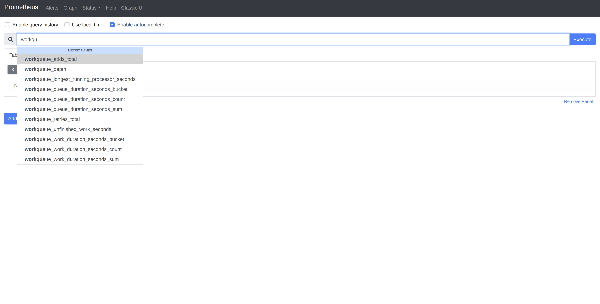
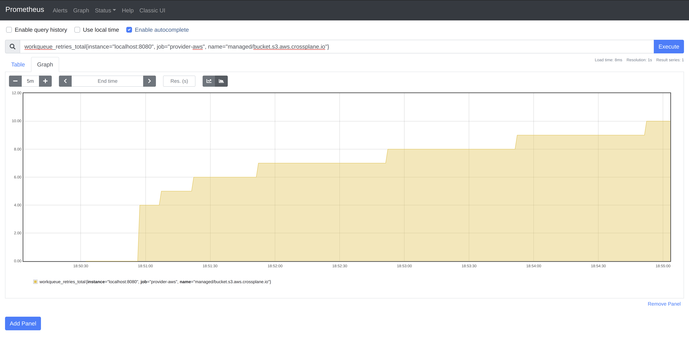

+++ 
draft = true
date = 2021-02-20T01:41:34-06:00
title = "Scraping controller-runtime Prometheus Metrics Locally"
slug = "controller-runtime-scrape-prometheus-local" 
tags = []
categories = []
+++

[`controller-runtime`](https://github.com/kubernetes-sigs/controller-runtime)
exposes a metrics server [by
default](https://github.com/kubernetes-sigs/controller-runtime/blob/2faebdb710c1626efaa1e4df7cfb05c32ce1bdf5/pkg/manager/manager.go#L514)
on [port
8080](https://github.com/kubernetes-sigs/controller-runtime/blob/2faebdb710c1626efaa1e4df7cfb05c32ce1bdf5/pkg/metrics/listener.go#L35)
for any [controller
`Manager`](https://github.com/kubernetes-sigs/controller-runtime/blob/2faebdb710c1626efaa1e4df7cfb05c32ce1bdf5/pkg/manager/manager.go#L51).
Metrics are registered for the
[client](https://github.com/kubernetes-sigs/controller-runtime/blob/2faebdb710c1626efaa1e4df7cfb05c32ce1bdf5/pkg/metrics/client_go_adapter.go#L52),
[workqueue](https://github.com/kubernetes-sigs/controller-runtime/blob/2faebdb710c1626efaa1e4df7cfb05c32ce1bdf5/pkg/metrics/workqueue.go#L40),
and on a [per-controller
basis](https://github.com/kubernetes-sigs/controller-runtime/blob/2faebdb710c1626efaa1e4df7cfb05c32ce1bdf5/pkg/internal/controller/metrics/metrics.go#L24).

Controllers [initialize
metrics](https://github.com/kubernetes-sigs/controller-runtime/blob/2faebdb710c1626efaa1e4df7cfb05c32ce1bdf5/pkg/internal/controller/controller.go#L147)
when started, and write to the registry at various points throughout operation,
such as when [processing items off the
workqueue](https://github.com/kubernetes-sigs/controller-runtime/blob/2faebdb710c1626efaa1e4df7cfb05c32ce1bdf5/pkg/internal/controller/controller.go#L250)
and [after completed reconciliation
loops](https://github.com/kubernetes-sigs/controller-runtime/blob/2faebdb710c1626efaa1e4df7cfb05c32ce1bdf5/pkg/internal/controller/controller.go#L298).
If you are using a framework like [Kubebuilder](https://book.kubebuilder.io), it
will generate manifests for the necessary objects, [such as a
`ServiceMonitor`](https://doc.crds.dev/github.com/prometheus-operator/kube-prometheus/monitoring.coreos.com/ServiceMonitor/v1@v0.7.0),
to scrape these metrics using
[kube-prometheus](https://github.com/coreos/kube-prometheus#installing) in your
Kubernetes cluster.

This is extremely useful, and you can [easily add additional
metrics](https://book.kubebuilder.io/reference/metrics.html#publishing-additional-metrics)
that you want to collect, then write to those collectors in your
[`Reconciler`](https://github.com/kubernetes-sigs/controller-runtime/blob/2faebdb710c1626efaa1e4df7cfb05c32ce1bdf5/pkg/reconcile/reconcile.go#L89)
implementation. However, this can be a bit heavy-handed when developing locally,
so it would be nice to have a simpler workflow for consuming metrics when you
just want to test something out. I frequently spin up a
[kind](https://kind.sigs.k8s.io/) cluster and simply `go run` my controllers
when experimenting with new functionality. In those times, I want to have a
dashboard that I can pull up and see what is happening with my local updates.

Accessing the `controller-runtime` metrics in this scenario is as easy as
navigating to `localhost:8080/metrics`. For example, after running the following
commands in in Crossplane's
[provider-aws](https://github.com/crossplane/provider-aws) (assuming your
`kubeconfig` is already pointing to an active Kubernetes cluster):

```console

kubectl apply -f package/crds
go run cmd/provider/main.go &
curl localhost:8080

```

We see the output (abridged below) of all of the collectors mentioned above:

```console

...
controller_runtime_active_workers{controller="managed/activity.sfn.aws.crossplane.io"} 0
controller_runtime_active_workers{controller="managed/api.apigatewayv2.aws.crossplane.io"} 0
controller_runtime_active_workers{controller="managed/apimapping.apigatewayv2.aws.crossplane.io"} 0
controller_runtime_active_workers{controller="managed/authorizer.apigatewayv2.aws.crossplane.io"} 0
controller_runtime_active_workers{controller="managed/backup.dynamodb.aws.crossplane.io"} 0
controller_runtime_active_workers{controller="managed/bucket.s3.aws.crossplane.io"} 0
controller_runtime_active_workers{controller="managed/bucketpolicy.s3.aws.crossplane.io"} 0
controller_runtime_active_workers{controller="managed/cachecluster.cache.aws.crossplane.io"} 0
...

```

This raw output is not super consumable, and is definitely not visually
aesthetic. Fortunately, the good folks who work on Prometheus have [provided an
image](https://prometheus.io/docs/prometheus/latest/installation/#using-docker)
on [Dockerhub](https://hub.docker.com/r/prom/prometheus/) and
[Quay](https://quay.io/repository/prometheus/prometheus) that we can run locally
to make these metrics much more useful. In order for the Prometheus instance to
know where to scrape metrics from, we have to provide it with an endpoint in its
[configuration
file](https://prometheus.io/docs/prometheus/latest/configuration/configuration/).
Here is an extremely simple configuration that will inform Prometheus where to
get our `provider-aws` metrics from, as well as where to scrape metrics for its
own operations.

> Note: By default, metrics are assumed to be served at the `/metrics` endpoint
> for the supplied targets.

```yaml
scrape_configs:
  - job_name: 'prometheus'
    scrape_interval: 5s
    static_configs:
      - targets: ['localhost:9090']
  - job_name: 'provider-aws'
    scrape_interval: 5s
    static_configs:
      - targets: ['localhost:8080']
```

The last step is to run the image with the configuration file above mounted and
host networking enabled (so that Prometheus is able to scrape the `provider-aws`
localhost endpoint).

> Note: Remember that if you are running Docker in a VM, additional
> configuration will be required as the network namespace for the Docker daemon
> is not the same as the local network namespace that the running controller
> will be utilizing.

```
docker run -d --net=host -v path/to/your/prometheus.yml:/etc/prometheus/prometheus.yml prom/prometheus
```

Navigate to `localhost:9090` and you will be met with the Prometheus dashboard.
Typing a few characters should invoke autocomplete with some of the collectors
we saw earlier.



To see some of the metrics in action, we must trigger the watches on objects
managed by the controllers. Since we do not have `provider-aws` configured with
credentials, reconciling any object is going to cause failed reconciliation.
Let's create an [S3
`Bucket`](https://doc.crds.dev/github.com/crossplane/provider-aws/s3.aws.crossplane.io/Bucket/v1beta1@v0.16.0)
and see what happens:

```
kubectl apply -f examples/s3/bucket.yaml
```

In a [recent
post](https://danielmangum.com/posts/controller-runtime-client-go-rate-limiting/),
I explored the `controller-runtime` rate limiting interface. In `provider-aws`,
the `Bucket` controller is configured with a per-item exponential backoff
limiter with a base delay of `1s` and a max delay of `60s`. Since our controller
is expected to continuously fail in this case, we should see the exponential
backoff represented in the graph of the `workqueue_retries_total` collector for
the `Bucket` controller.



As you can see, the delay between reconciles for our single item doubles until
reaching the max delay of `60s`, at which time it remains constant.

> Note: You will notice the first few requeues are not reflected on the graph
> due to our scraping interval of `5s`. This can be adjusted if more granular
> data is required.

While this is a somewhat trivial example, the ability to quickly view the
behavior of controllers, especially when running hundreds of them under a single
manager, can be extremely valuable when troubleshooting performance issues.

Send me a message [@hasheddan](https://twitter.com/hasheddan) on Twitter for any
questions or comments!
