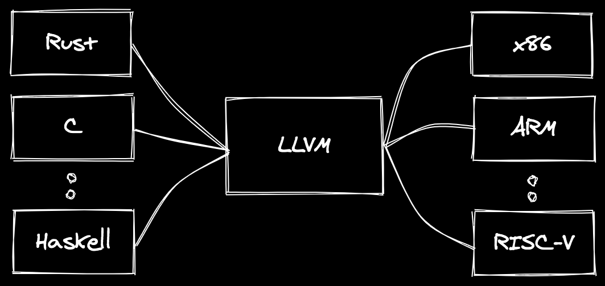
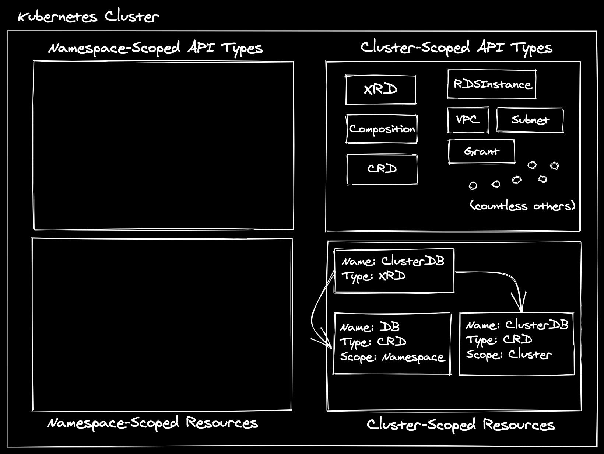
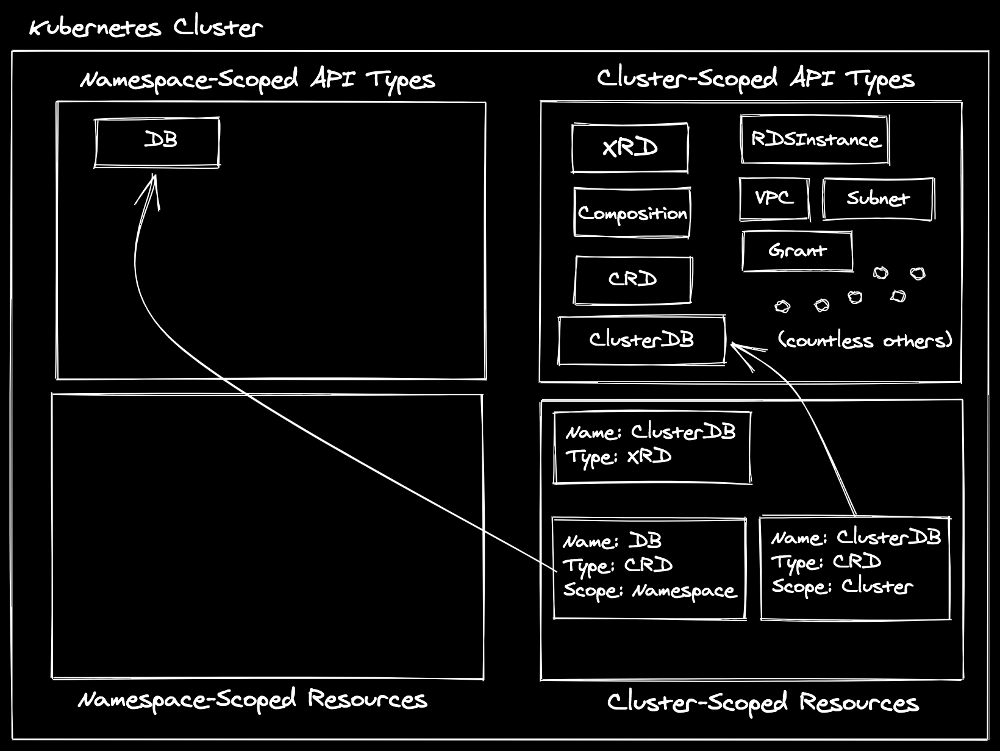
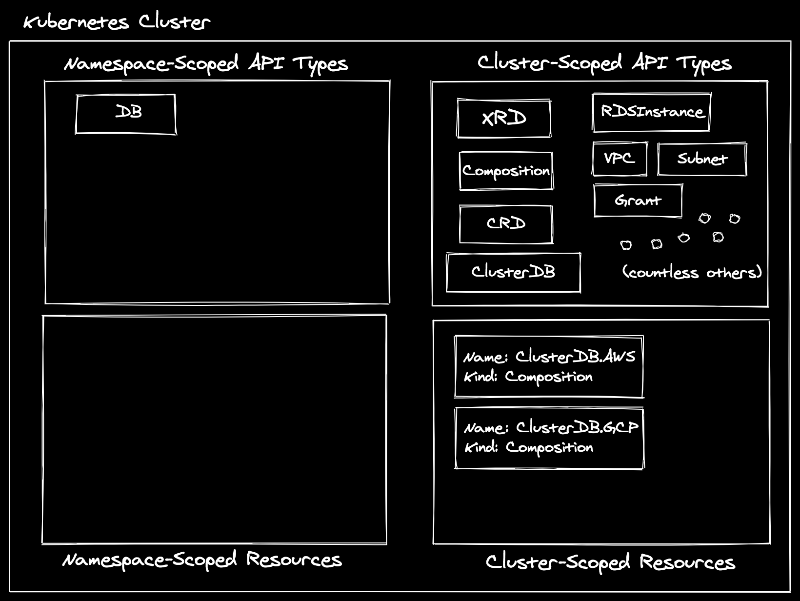
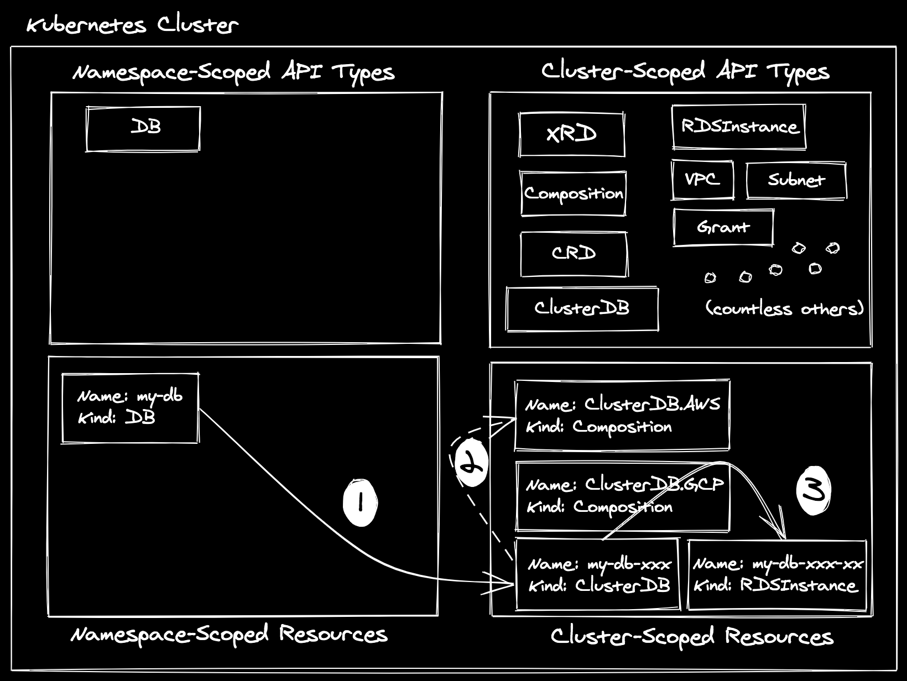
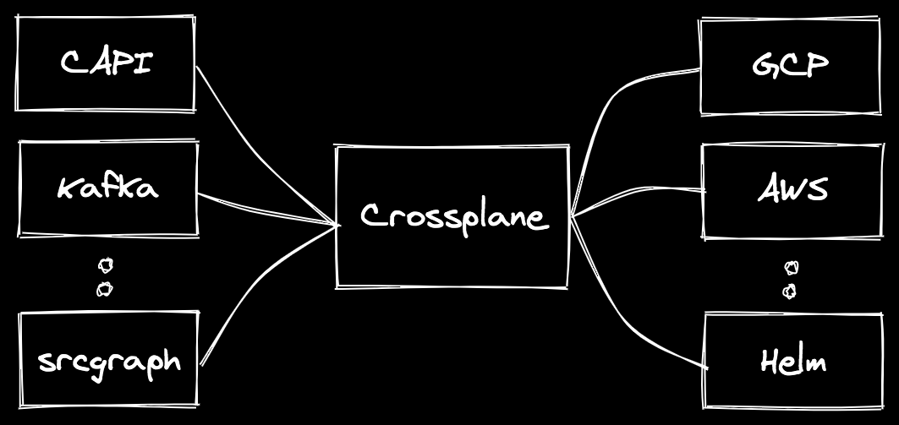

+++ 
draft = false
date = 2021-03-13T01:41:34-06:00
title = "Is Crossplane the Infrastructure LLVM?"
slug = "crossplane-infrastructure-llvm" 
tags = []
categories = []
+++

If I was to explain [LLVM](https://llvm.org/) in a painfully simple manner, I
might say something like: "LLVM is a framework that allows you to define a
syntax for interacting with computers, and instantly have it work for all
computers". This description does a colossal disservice to the scope of the
project, but it serves to illustrate the basic idea: there are many languages
(frontends) and many CPU architectures (backends) and we don't want to
re-implement every translation permutation.



Furthermore, if we can make some generic optimizations in the middle, we get
wins across all languages and architectures. Consumers of compilers built on
LLVM can also pick and choose what sort of optimizations they want to enable,
and most of them come with tradeoffs. When debugging a program, we may want to
trade some performance optimizations for faster compilation times. When
deploying an application to production, we may opt for the latter. Importantly,
the language designer does not have to implement all of these different options,
they merely have to *expose* them.

The [Rust compiler](https://doc.rust-lang.org/rustc/), for example, exposes
flags, [such as
`opt-level`](https://doc.rust-lang.org/rustc/codegen-options/index.html#opt-level),
to allow users to tune these optimizations to their liking. It also allows for
customization of debug information included in the generated binary, using
[flags like
`debuginfo`](https://doc.rust-lang.org/rustc/codegen-options/index.html#debuginfo).
This is extremely valuable functionality, and something Rust mostly gets for
free by being [built on
LLVM](https://rustc-dev-guide.rust-lang.org/backend/codegen.html). There is much
more we could explore here, and maybe we will in another post, but that is not
our focus for today. 

> If you are interested in learning more about LLVM and how to use it, I highly
> recommend [the Kaleidoscope tutorial](https://llvm.org/docs/tutorial/).

### Crossplane - Explained by a Human

So what does this have to do with [Crossplane](https://crossplane.io/)?
Crossplane is neither a language nor a target architecture -- its documentation
says it is "... an open source Kubernetes add-on that supercharges your
Kubernetes clusters enabling you to provision and manage infrastructure,
services, and applications from kubectl". That is some great marketing copy!
[^1]

We'll keep up our trend of overly simplifying extremely complex systems by
describing [Kubernetes](https://kubernetes.io/) as a "distributed system
framework that just incidentally happens to be commonly used for orchestrating
containers"[^2]. Even folks who have had only the most elementary introduction
to Kubernetes will likely recognize some of the API types it offers, such as
`Pods`, `Deployments`, and `Services`. These are the components that lead the
project to frequently be described as a "container orchestrator", and they are
built-in the the API server.

Kubernetes also, (in)famously[^3], allows anyone to extend the API using another
built-in type [named
`CustomResourceDefinitions`](https://kubernetes.io/docs/concepts/extend-kubernetes/api-extension/custom-resources/)
(CRDs). Crossplane takes advantage of this functionality by introducing a [few
core CRDs](https://doc.crds.dev/github.com/crossplane/crossplane) into your
cluster, then allowing you to add many more by installing various
[packages](https://crossplane.io/docs/v1.1/concepts/packages.html).

The core CRDs enable two main feature areas in Crossplane: composition and
package management.
[Composition](https://crossplane.io/docs/v1.1/concepts/composition.html) allows
you to take granular Kubernetes API types and create new abstract API types that
map to one or more of them. The package manager allows you to introduce,
version, and upgrade more of these primitive API types in your cluster.
Crossplane has two types of packages:
[Providers](https://crossplane.io/docs/v1.1/concepts/packages.html#provider-packages)
and
[Configurations](https://crossplane.io/docs/v1.1/concepts/packages.html#configuration-packages).
Let's take a look at Providers first.

Crossplane Providers are a set of Kubernetes CRDs and
[controllers](https://kubernetes.io/docs/concepts/architecture/controller/) that
reconcile them. These CRDs are high-fidelity, 1:1 representations of external
APIs. We refer to this type of CRD as a "managed resource", and they are all
cluster-scoped[^6]. The controllers that reconcile them know how to take the
specification of the resource and drive its external state to match it. Common
examples of Crossplane Providers include
[provider-gcp](https://github.com/crossplane/provider-gcp),
[provider-aws](https://github.com/crossplane/provider-aws),
[provider-helm](https://github.com/crossplane-contrib/provider-helm),
[provider-sql](https://github.com/crossplane-contrib/provider-sql), and
countless others. Each of these introduce CRDs for their APIs. For example,
provider-gcp installs CRDs such as `CloudSQLInstance` and `GKECluster`, while
provider-sql installs `Database`, `User`, and more. Once these Providers are
installed into a Crossplane cluster, you could create instances of them and they
would be provisioned via the corresponding API.

Before jumping to Configuration packages, let's take a brief detour into
composition. If we installed some of the Providers mentioned above, we now have
many managed resource CRDs in our cluster. Some of these are _very complex_,
requiring configuration of [many
fields](https://doc.crds.dev/github.com/crossplane/provider-aws/database.aws.crossplane.io/RDSInstance/v1beta1@v0.17.0),
and some depend on the existence of other resources before they can be used
effectively. An `RDSInstance` might require other AWS managed resources, such as
a`VPC`, `Subnet`, `SecurityGroup`, etc. as well as SQL resources, such as
`Database`, `User`, and `Grant`, before an application can connect. It is
difficult for even an experienced cloud architect[^4]. In response,
organizations either require developers to contact infrastructure admins and ask
them to set up the proper resources they need, or they throw security out the
window and subject developers to baptism by fire. The first solution removes any
notion of DevOps[^5], and the second is not something anyone is going to be
excited about, unless your name is [Ian
Coldwater](https://twitter.com/IanColdwater).

Crossplane aspires to provide a third option by allowing infrastructure admins
to define abstract infrastructure types and templates that map to them. In the
example with the `RDSInstance`, the developer does not really want an
`RDSInstance`. They want a `PostgreSQL` or `MySQL` database. The fact that the
database is on AWS, GCP, or running in the server closet down the hall is of no
concern to them. However, they may want to influence some characteristics of
that database, such as its size, locality, or engine. Infrastructure admins can
choose what knobs to expose to developers, and may choose to expose more to some
teams than others.

Alright, enough playing around, let's [look at some
YAML](https://media.giphy.com/media/CDZwopbecAbIc/giphy.gif). The two primary
API types that are used to facilitate this workflow are
`CompositeResourceDefinitons` (XRDs) and `Compositions`. XRDs are what define
the abstract type. When an infrastructure admin creates an XRD, Crossplane
responds by creating a cluster-scoped CRD, and optionally a namespace-scoped CRD
as well. Here is one for a `DB`, with only one configurable field (`storageGB`),
which is similar to the example from the Crossplane [getting started
guide](https://crossplane.io/docs/v1.1/getting-started/create-configuration.html#create-compositeresourcedefinition).

```yaml

apiVersion: apiextensions.crossplane.io/v1
kind: CompositeResourceDefinition
metadata:
  name: clusterdbs.example.org
spec:
  group: example.org
  names:
    kind: ClusterDB
    plural: clusterdbs
  claimNames:
    kind: DB
    plural: dbs
  connectionSecretKeys:
    - username
    - password
    - endpoint
    - port
  versions:
  - name: v1alpha1
    served: true
    referenceable: true
    schema:
      openAPIV3Schema:
        type: object
        properties:
          spec:
            type: object
            properties:
              parameters:
                type: object
                properties:
                  storageGB:
                    type: integer
                required:
                  - storageGB
            required:
              - parameters

```

If you were to `kubectl apply` this manifest in your Kubernetes cluster where
Crossplane is installed, you would see after a few seconds that a `ClusterDB`
(`spec.names.kind`) cluster-scoped CRD existed, and a `DB`
(`spec.claimNames.kind`). As of this point, our cluster looks like the
following:



> Note: All of the CRD instances that exist in the "Cluster-Scoped Resources"
> box and define the managed resources (e.g. `RDSInstance`) and core Crossplane
> types (e.g. `Composition`) in the "Cluster-Scoped API Types" box have been
> omitted for brevity, but they are present as well.

Crossplane creates these CRDs on your behalf, using the `openAPIV3Schema` your
provide, as well as [injecting some common
fields](https://github.com/crossplane/crossplane/blob/b3ad3966a9ba3bdbad1779c03b9179d92ba945f8/internal/xcrd/schemas.go#L34)
that Crossplane uses for machinery. Next, Kubernetes, as it does for all CRDs,
will register the defined schemas as API types at the cluster and namespace
scopes respectively:



Now anyone in the cluster, given proper RBAC permissions, could create a `DB` in
a given namespace, or a `ClusterDB` at the cluster scope. In Crossplane
vernacular, We call the cluster-scoped variant (`ClusterDB`) an "XR" or
"composite resource", and the namespace-scoped variant (`DB`) an "XRC" or
"composite resource claim". The other thing Crossplane is going to do when an
XRD is created is dynamically start controllers to watch both the
[XR](https://github.com/crossplane/crossplane/blob/b3ad3966a9ba3bdbad1779c03b9179d92ba945f8/internal/controller/apiextensions/definition/reconciler.go#L392)
and
[XRC](https://github.com/crossplane/crossplane/blob/b3ad3966a9ba3bdbad1779c03b9179d92ba945f8/internal/controller/apiextensions/offered/reconciler.go#L393)
variants. These controllers watch for users to create instances of these types,
then use generic logic to match the instances to templates that have declared
they can satisfy the type. We'll need to create at least one of those templates
for these types to be of any use to us.

The `Composition` type is used to define a new template. These can be relatively
simple, such mapping our namespace-scoped `DB` to a cluster-scoped `RDSInstance`
and hard-coding some fields. This is useful for a policy enforcement and
permission isolation[^7]. An example `Composition` that does this could look as
follows:

```yaml

apiVersion: apiextensions.crossplane.io/v1
kind: Composition
metadata:
  name: clusterdbs.aws.example.org
  labels:
    provider: aws
    environment: dev
spec:
  writeConnectionSecretsToNamespace: crossplane-system
  compositeTypeRef:
    apiVersion: example.org/v1alpha1
    kind: ClusterDB
  resources:
    - name: rdsinstance
      base:
        apiVersion: database.aws.crossplane.io/v1beta1
        kind: RDSInstance
        spec:
          forProvider:
            region: us-east-1
            dbInstanceClass: db.t2.small
            masterUsername: masteruser
            engine: postgres
            engineVersion: "9.6"
            skipFinalSnapshotBeforeDeletion: true
            publiclyAccessible: true
          writeConnectionSecretToRef:
            namespace: crossplane-system
      patches:
        - fromFieldPath: "metadata.uid"
          toFieldPath: "spec.writeConnectionSecretToRef.name"
          transforms:
            - type: string
              string:
                fmt: "%s-postgresql"
        - fromFieldPath: "spec.parameters.storageGB"
          toFieldPath: "spec.forProvider.allocatedStorage"
      connectionDetails:
        - fromConnectionSecretKey: username
        - fromConnectionSecretKey: password
        - fromConnectionSecretKey: endpoint
        - fromConnectionSecretKey: port

```

Running `kubectl apply` with this manifest will create the `Composition`
instance at the cluster scope. It declares in its `compositeTypeRef` that it can
satisfy the `ClusterDB` abstraction, meaning that those dynamic controllers the
Crossplane started for the XR (`ClusterDB`) and XRC (`DB`) will _both_ view this
as a valid template to target. Furthermore, you'll notice we are patching from
the `spec.parameters.storageGB` on the XR / XRC to the
`spec.forProvider.allocatedStorage` field on the templated `RDSInstance`. This
means that the developer can specify the size of the database without actually
knowing what is satisfying the request, and also means that we could just as
easily swap out the `RDSInstance` template for a `CloudSQLInstance` one for GCP:

```yaml

apiVersion: apiextensions.crossplane.io/v1
kind: Composition
metadata:
  name: clusterdb.gcp.example.org
  labels:
    provider: gcp
    environment: dev
spec:
  writeConnectionSecretsToNamespace: crossplane-system
  compositeTypeRef:
    apiVersion: example.org/v1alpha1
    kind: ClusterDB
  resources:
    - name: cloudsqlinstance
      base:
        apiVersion: database.gcp.crossplane.io/v1beta1
        kind: CloudSQLInstance
        spec:
          forProvider:
            databaseVersion: POSTGRES_9_6
            region: us-central1
            settings:
              tier: db-custom-1-3840
              dataDiskType: PD_SSD
              ipConfiguration:
                ipv4Enabled: true
                authorizedNetworks:
                  - value: "0.0.0.0/0"
          writeConnectionSecretToRef:
            namespace: crossplane-system
      patches:
        - fromFieldPath: "metadata.uid"
          toFieldPath: "spec.writeConnectionSecretToRef.name"
          transforms:
            - type: string
              string:
                fmt: "%s-postgresql"
        - fromFieldPath: "spec.parameters.storageGB"
          toFieldPath: "spec.forProvider.settings.dataDiskSizeGb"
      connectionDetails:
        - fromConnectionSecretKey: username
        - fromConnectionSecretKey: password
        - fromConnectionSecretKey: endpoint
        - type: FromValue
          name: port
          value: "5432"

```

In this case, `spec.parameters.storageGB` is being mapped to
`spec.forProvider.settings.dataDiskSizeGb`, but from the developer's
perspective, it will have the same effect of setting the size of the database.

You can define as many of these templates as you like for an XR / XRC pair. The
template that is chosen when an actual instance of the XR / XRC is created is
dictated by labels (you'll notice we added a few in the `Compositions` above).
Before we actually create an instance of an XRC or XR, let's take another peek
at our cluster:



> Note: CRD instances and XRD instances are omitted in "Cluster-Scoped
> Resources" here as well.

Things are coming along! However, I must confess something to you: I told a lie.
It was well-meaning, but a lie nonetheless. I said that these templates could
satisfy both the XR _and_ the XRC. The truth of the matter is that they can only
satisfy the XR, but the creation of an XRC results in creation of an XR.

> Note: though we will not demonstrate it today, this property of an XRC being
> bound to an XR means that infrastructure admins could "pre-provision"
> infrastructure by creating an XR directly, then have developers just create
> the XRC that binds to the existing XR, rather than creating a new one
> entirely. Yep -- there is some fun stuff you can do here.

Let's create the following XRC and see what happens in our cluster.

```yaml

apiVersion: example.org/v1alpha1
kind: DB
metadata:
  name: my-db
  namespace: default
spec:
  parameters:
    storageGB: 20
  compositionSelector:
    matchLabels:
      provider: aws
  writeConnectionSecretToRef:
    name: db-conn

```

Whoa, that's pretty simple! You're telling me that's all I have to do to create
a fairly complex database instance? Neat! [^8] Behind the scenes, Crossplane is
executing the following steps:

1. Create a corresponding cluster-scoped XR (`my-db-xxx`) for the
   namespace-scoped XRC (`my-db`).
2. Match the XR to a compatible template. We specified `matchLables` with
   `provider: aws` in our XRC, so the only `Composition` we can match to is
   `clusterdbs.aws.example.org`.
3. Create the templated managed resources by taking the values provided on the
   XR / XRC and patching them to the resources as defined by the selected
   `Composition`. In this case, this results in the creation of a single
   `RDSInstance` with some hard-coded values and the `allocatedStorage: 20`. At
   that point, the provider-aws controller is responsible for managing the
   `RDSInstance` (it responds the same whether the resource was created directly
   by a user or indirectly using composition). Crossplane's composition
   machinery will reflect relevant parts of the status back to the XR / XRC, as
   well as the connection details (which we won't spend too much time on today).



This is a nice abstraction layer, but a rather trivial example. In a production
scenario, you likely do not want your database exposed publicly to the entire
internet, so you will need to set up networking infrastructure around it, and
reference it from the database. The Crossplane [getting-started
guide](https://crossplane.io/docs/v1.1/getting-started/create-configuration.html#create-compositions)
has a wonderful "AWS with New VPC" example that I encourage you to take a look
at, but I will not copy it here because this post is getting quite long, I
haven't even gotten to the point, and too large of a YAML wall at this point
would likely cause everyone but my own mother to abandon ship. The main idea is
that we go through the exact same flow as above, but instead of just spitting
out an `RDSInstance`, we spit out:

- 1 `VPC`
- 3 `Subnets`
- 1 `DbSubnetGroup`
- 1 `InternetGateway`
- 1 `RouteTable`
- 1 `SecurityGroup`
- 1 `RDSInstance`

...and they all work together because of a powerful feature of Crossplane
managed resources called [cross-resource
references](https://crossplane.io/docs/v1.1/concepts/managed-resources.html#dependencies).
[^9]

So we've established how Crossplane composition works, let's get back to
packaging. Your XRDs and `Compositions` are essentially how you are buidling
your own platform API, and if you have a limited number of clusters, it may make
sense to just throw them in a git repo and `kubectl apply` them when you make
updates. There are a fair amount of Crossplane users that follow this exact
strategy. However, I ask you to indulge me for a moment while I explore another
strategy that will likely seem excessive at first, but I promise to prove its
worth in a moment[^10].

As mentioned before, Crossplane has a concept of a Configuration package. This
is similar to the Provider package, but instead of CRDs and a controller, they
only include XRDs and `Compositions`. They also can declare dependencies on
Provider packages, meaning that when you install a Configuration package,
Crossplane will make sure a compatible version of all Providers it depends upon
are present in the cluster and will install them if they are not. Both types of
Crossplane packages are formatted as [OCI
images](https://github.com/opencontainers/image-spec), meaning that they can be
pushed to any registry, such as DockerHub, GCR, or the [Upbound
Registry](https://cloud.upbound.io/browse). [^11]

This allows you (and anyone else if the package is public or shared) to have a
"one-click" experience of deploying your entire platform API to any Crossplane
cluster in a repeatable way. Once again, this has limited value if you are
running a single cluster for your internal control plane, but if you have any
intention of sharing, it can be very powerful. [^12]

### Crossplane as a Cluster API Backend

I think up until this point we have done an admirable job of showing how
Crossplane can provide value to an organization that wishes to allow developers
to self-service their infrastructure without making their environments the wild
west from a policy enforcement perspective. But this has been shared before and
isn't really reason for another blog post.

What I am more interested in is how Crossplane's packaging and composition
models can be used with other Kubernetes controllers. And let's not beat around
the bush, there is one specific project where this could be of immense value:
[Cluster API](https://cluster-api.sigs.k8s.io/) (CAPI). I have [been
working](https://youtu.be/YBfSlh2duwo) with a few of the CAPI maintainers to
think about how the two projects could collaborate.

> DISCLAIMER: Cluster API is a rapidly changing project and I am certainly not
> the foremost expert. However, regardless of the exact details the concepts
> below should continue to hold.

The mission of Cluster API is allow provisioning Kubernetes clusters using the
Kubernetes API itself. CAPI works by implementing [core controllers and API
types](https://github.com/kubernetes-sigs/cluster-api), then interfacing with
three types of providers:

- **Cluster Infrastructure Providers:** supplies whatever prerequisites are
  necessary for running machines. Examples might include networking, load
  balancers, firewall rules, and so on.
- **Machine Infrastructure Providers:** responsible for managing the lifecycle
  of provider-specific machine instances. These may be physical or virtual
  instances, and they represent the infrastructure for Kubernetes nodes.
- **Bootstrap Providers:** generates bootstrap data that is used to bootstrap a
  Kubernetes node.

In practice, Cluster and Machine providers are typically packaged together and
have a lot of similarities with Crossplane providers:
[cluster-api-provider-gcp](https://github.com/kubernetes-sigs/cluster-api-provider-gcp),
[cluster-api-provider-aws](https://github.com/kubernetes-sigs/cluster-api-provider-aws),
and so on. Each of these providers supplies concrete implementations of the
abstract types required by core CAPI. [^13] For instance, core CAPI has a
[Cluster](https://doc.crds.dev/github.com/kubernetes-sigs/cluster-api/cluster.x-k8s.io/Cluster/v1alpha3@v0.3.13)
type, which references a concrete provider implementation [in its
`spec.infrastructureRef`](https://doc.crds.dev/github.com/kubernetes-sigs/cluster-api/cluster.x-k8s.io/Cluster/v1alpha3@v0.3.13#spec-infrastructureRef).
If using cluster-api-provider-gcp, the referenced type [would be
`GCPCluster`](https://doc.crds.dev/github.com/kubernetes-sigs/cluster-api-provider-gcp/infrastructure.cluster.x-k8s.io/GCPCluster/v1alpha3@v0.3.0).
Behind the scenes, cluster-api-provider-gcp [implements a
controller](https://github.com/kubernetes-sigs/cluster-api-provider-gcp/blob/02287ce00bd5aad39cf0cfbcef7027fe9a8f5c38/controllers/gcpcluster_controller.go#L154)
that sets up all of the infrastructure required to run Kubernetes on GCP, other
than the nodes (which are handled by the `GCPMachine` / `GCPMachineTemplate`
types and their corresponding controllers). The list of infrastructure resources
managed by the `GCPCluster` controller includes[^14]:

- `Network`
- `Router`
- `GlobalAddress`
- `HealthCheck`
- `BackendService`
- `TargetTcpProxy`
- `ForwardingRule`
- `InstanceGroup`
- `Firewall`

This differs from Crossplane's provider-gcp, as each of these resources have
their own controller. In comparison, CAPI introduces abstraction at the
_controller level_, while Crossplane implements it at the _composition level_.
In Crossplane, we would define a `GCPCluster` XRD (or even just a generic
`Cluster`, since we can have many `Compositions` for a single XRD) and a
`Composition` with templates for all of the resources listed above. Why move
abstraction to the composition level? There are a few reasons.

First, it leads to small, focused controllers with minimal scope. Crossplane
provider controllers are interested in reconciling their 1:1 representative
external resource with the corresponding object in the cluster. Presumably a
reason for bundling many external resources into a single controller in CAPI is
because they have many related fields and references to each other. However,
Crossplane addresses this by the aforementioned cross-resource reference model.

Second, and most importantly, it allows for easy customization by users. In the
CAPI model, if a user wants to change some aspect of the `Firewall` resource,
the `GCPCluster` API must be modified to expose that field, and the controller
must be modified to honor it. Alternatively, when using Crossplane composition,
a user could modify or create a new `Composition` that maps to a `GCPCluster`
XRD with the `Firewall` template modified, or add a field to the `GCPCluster`
XRD that patches to the relevant field on the `Firewall` for "provision-time"
customization. This is faster, more flexible, and doesn't require actually
modifying any code.

Third, since Crossplane allows users to package up `Compositions` and XRDs into
Configuration packages, these different cluster configurations can be easily
shared. For instance, the community could define Configuration packages that
supply "production cluster configurations" and "development cluster
configurations", with the latter optimizing for cost and the former optimizing
for high availability. Furthermore, these packages will automatically install
the necessary managed resources by declaring dependencies on the relevant
Crossplane Providers.

Lastly, it brings together the cloud-native community to accelerate the effort
to define infrastructure using the declarative Kubernetes API. The CAPI,
Crossplane, and various provider-specific communities have all done a lot of
work to this end, but the longer we stay fragmented, the more duplicate work we
will perform.

### Weren't We Talking About LLVM?

Ah yes, sorry about that, this post is supposed to be about Crossplane _and_
LLVM. You may already see where we are going. We described Crossplane as a
"backend" for Cluster API, but really Crossplane itself is the customizable
translation layer, and Crossplane's Providers are the backends that target
infrastructure APIs, similar to the LLVM backends the target different ISAs.
LLVM provides a more friendly interface to compute resources -- CPU, memory,
etc. -- for its compiler frontends, while Crossplane provides a friendly
interface to cloud infrastructure.



In the example above, CAPI, and operators for [Kafka](https://kafka.apache.org/)
and [Sourcegraph](https://about.sourcegraph.com/), are deploying distributed
systems that require infrastructure. They all can run on various cloud
providers, and Kafka and Sourcegraph can run on Kubernetes itself. Importantly,
Crossplane providers can target _any_ API, not jut the cloud providers, so
something like
[provider-helm](https://github.com/crossplane-contrib/provider-helm) could be a
backend for deploying something like
[Kafka](https://github.com/bitnami/charts/tree/master/bitnami/kafka/) on
Kubernetes.

### Closing Thoughts

As you can tell from my endless droning on, I am very excited about this
direction for the cloud-native community. While I paint a rosy picture, there is
still quite a lot of work to be done, but I can say for certain that I, and
others in the Crossplane community, will show up to do our part.

I also want to acknowledge the incredible work the Cluster API community has
done to build an innovative project that [continues to gain wide
adoption](https://www.giantswarm.io/blog/giant-swarms-epic-journey-to-cluster-api-giant-swarm).
Any future work will be standing on the shoulders of giants.

Send me a message [@hasheddan](https://twitter.com/hasheddan) on Twitter for any
questions or comments!

[^1]: I'm allowed to say snarky stuff like this because I helped write it.
[^2]: I had too much coffee this morning and now I'm just getting carried away.
[^3]: Once again, I am calling myself out here as we have really taken this extension mechanism to its logical conclusion by shoving [a lot](https://doc.crds.dev/github.com/crossplane/provider-aws) of CRDs into your cluster.
[^4]: This was my job title once and I still don't know what it means -- yet here I am using it in a blog post that I proclaim contains valuable information. Life comes at you fast.
[^5]: There I go again, using words that don't mean anything.
[^6]: Please read this [wonderful post](https://blog.crossplane.io/crossplane-vs-cloud-infrastructure-addons/) by fellow Crossplane maintainer [Nic Cope](https://twitter.com/internegz) before you commence yelling at me.
[^7]: Read more about moving the level of permissioning to the level of abstraction in this other [terrific post](https://blog.crossplane.io/crossplane-vs-terraform/) by [Nic](https://twitter.com/internegz). Also, if you are familiar with [Open Policy Agent](https://www.openpolicyagent.org/) your mind is probably already going to some wild places.
[^8]: Update: the day has progressed, the coffee is wearing off, and sarcasm levels are rising.
[^9]: This feature is another reason to have cluster-scoped managed resources -- okay, you can continue yelling at me now.
[^10]: Apologies for burying the lede here. Also, did you know that it is spelled "lede" when you say "burying the lede"? I sure didn't. Or maybe it isn't spelled "lede" and "lead" is actually correct. I really don't know at this point, [you decide](https://www.merriam-webster.com/words-at-play/bury-the-lede-versus-lead).
[^11]: The Upound Registry provides some additional functionality for indexing Crossplane packages over any vanilla image registry, plus I work for Upbound so I am basically required by law to shill for it. There are some real benefits, but you can also use other registries if you please.
[^12]: I promise the moment of truth is coming.
[^13]: Hmm, this sounds familiar.
[^14]: You can see more detail and relevant controller links in [this issue](https://github.com/crossplane/provider-gcp/issues/303).
