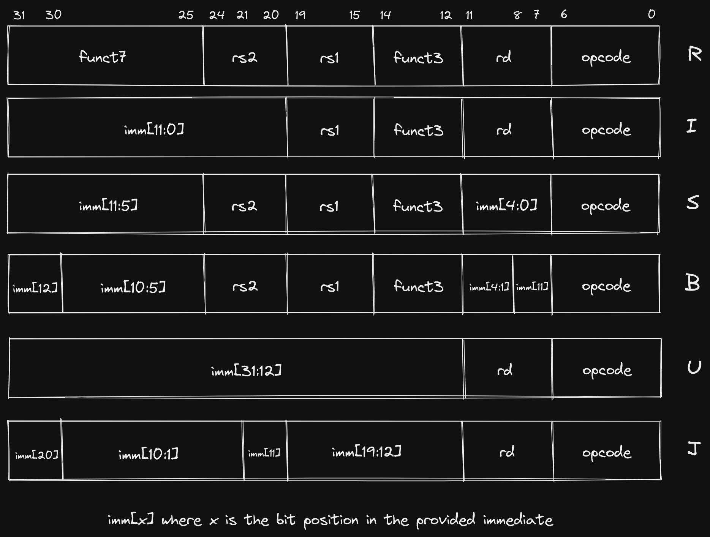
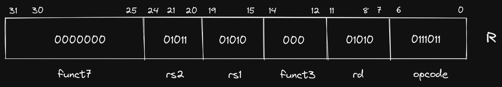
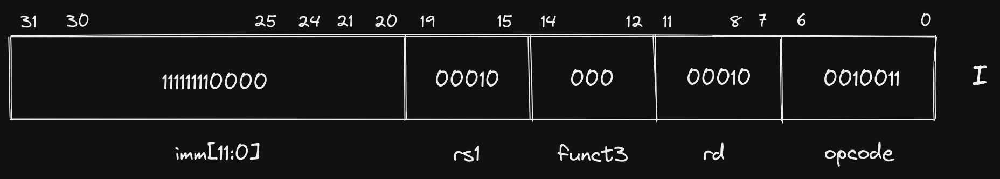
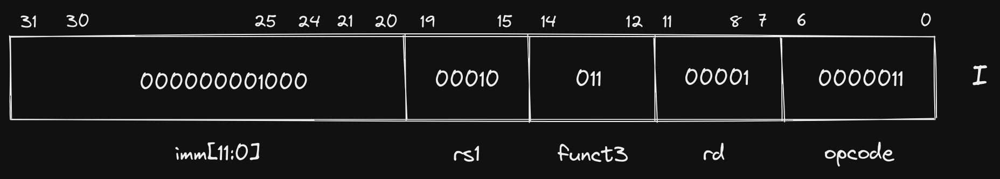
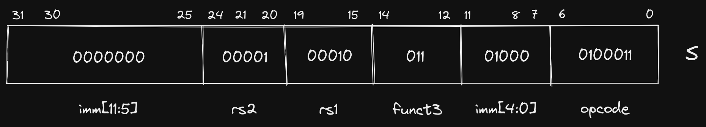
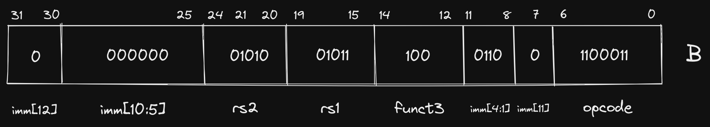
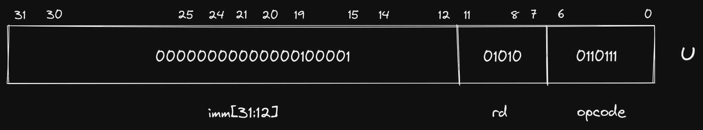
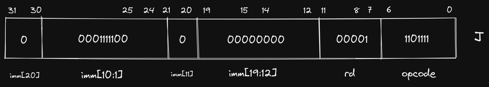

+++ 
draft = false
date = 2021-07-12T00:10:34-06:00
title = "RISC-V Bytes: Introduction to Instruction Formats"
slug = "risc-v-bytes-intro-instruction-formats" 
tags = []
categories = ["RISC-V Bytes"]
+++

> This is part of a series on the blog where we explore
> [RISC-V](https://riscv.org/) by breaking down real programs and explaining how
> they work. You can view all posts in this series on the [RISC-V Bytes
> page](https://danielmangum.com/categories/risc-v-bytes).

So far in this series, we have been looking at the assembly generated when
compiling relatively simple programs. At this point, we have seen instructions
that perform a wide variety of operations. Let's take another look at our
minimal example from the [Passing on the Stack
post](https://danielmangum.com/posts/risc-v-bytes-passing-on-the-stack/):

`minimal.c`

```c

#include <stdio.h>

int sum(int one, int two) {
    return one + two;
}

int main() {
    printf("The sum is: %d\n", sum(1, 2));
    return 0;
}

```

`riscv64-unknown-elf-gcc -O3 -fno-inline -march=rv64g minimal.c`

> Hold up a minute, what is that `-march=rv64g` doing in there? We didn't
> compile with that flag in the last post, but we are providing it here to
> disable instruction compression. The default `march` for our toolchain is
> `rv64gc` (or more specifically `rv64imafdc`), but we are removing the `C`
> extension, which indicates that a machine supports instruction compression. In
> a future post we will explore how compression improves code size and why it
> makes our generated assembly look different. You may already notice some
> changes in the output below!

```

(gdb) disass main
Dump of assembler code for function main:
   0x00000000000100b0 <+0>:         addi        sp,sp,-16
   0x00000000000100b4 <+4>:         li          a1,2
   0x00000000000100b8 <+8>:         li          a0,1
   0x00000000000100bc <+12>:        sd          ra,8(sp)
   0x00000000000100c0 <+16>:        jal         ra,0x101b8 <sum>
   0x00000000000100c4 <+20>:        mv          a1,a0
   0x00000000000100c8 <+24>:        lui         a0,0x21
   0x00000000000100cc <+28>:        addi        a0,a0,-192 # 0x20f40
   0x00000000000100d0 <+32>:        jal         ra,0x10418 <printf>
   0x00000000000100d4 <+36>:        ld          ra,8(sp)
   0x00000000000100d8 <+40>:        li          a0,0
   0x00000000000100dc <+44>:        addi        sp,sp,16
   0x00000000000100e0 <+48>:        ret
End of assembler dump.
(gdb) disass sum
Dump of assembler code for function sum:
   0x00000000000101b8 <+0>:         addw        a0,a0,a1
   0x00000000000101bc <+4>:         ret
End of assembler dump.

```

[View on Compiler Explorer](https://godbolt.org/z/najsrcG74)

In just this small example, we see multiple different types of instructions, and
their operands do not all look the same. Let's take a look at a few of them:

- `addi`: we are using this in three different places in `<main>` to add or
  subtract a value from one register and store it in another.

```

<+0>:      addi        sp,sp,-16         # increase size of the stack frame by subtracting 16 bytes from stack pointer
...
<+28>:     addi        a0,a0,-192        # add -192 (base 10) to the value currently in a0
...
<+44>:     addi        sp,sp,16          # move stack pointer back to its location when we began the procedure

```

- `sd`: we are using this in `<main>` to store the
  [caller-saved](https://danielmangum.com/posts/risc-v-bytes-caller-callee-registers/)
  return address (`ra`) to a memory location on the stack.

```

<+12>:    sd      ra,8(sp)

```

- `lui`: we are using this in `<main>` to do . . . something?

> Don't worry, we are going to define "something" in a bit.

```

<+14>:    lui     a0,0x21

```

- `addw`: we are using this in `<sum>` to add the values in `a0` and `a1` and
  store the result in `a0`.

```

<+0>:     addw    a0,a0,a1

```

There are more instructions than these four, but you'll notice something
interesting about this group: all of them take operands in a slightly different
manner. For instance, `addi` takes three operands, two of which are registers,
and one of which is a decimal value (base 10). `sd` takes two operands, one
register and one register with an _offset_ (more on this in a bit). `lui` takes
two operands as well, the first being a register, and the second being a
hexadecimal value (base 16). Lastly, `addw` takes three operands, all of them
registers.

Why is this interesting? Well, though we often think about assembly as "talking
directly to the hardware", it is important to remember that the processor
understands binary machine code. Therefore, each of these instructions, as well
as all of their operands, must be encoded in binary in order to be interpreted.
When different operations require varying numbers and types of operands, we must
tell the processor how to interpret the operands that we provide.

## RISC-V Instruction Format Overview

The binary encoding of an operation is referred to as its instruction format.
RISC-V has six core instruction formats:



> The `B` format is variation of `S` and is sometimes referred to as `SB`.
> Similarly, the `J` format is a variation of `U` and is sometimes referred to
> as `UJ`.

There are a few immediate observations we can make about these core formats:
- They are all 32 bits (`[31:0]`) wide.
- They all reserve the first 7 bits (`[6:0]`) for the `opcode`.
- If two formats support the same operand, that operand is always in the same
  location in the instruction (e.g. `R`, `I`, `S`, and `B` formats all have an
  `rs1` operand and it is always encoded in bits `[19:15]`).
- Each involves at least one register operand (`rd` / `rs1`/ `rs2`).
- All register operands are the same number of bits (5).

Each format is designed to accommodate certain types of instructions. While two
types of instructions that fall under the same format may seem unrelated, we
will see later on that they frequently will be implemented using the same
underlying operations in the Arithmetic Logic Unit (ALU).

- `R`: register-register ALU instructions ([jump to section](/posts/risc-v-bytes-intro-instruction-formats#r-format))
- `I`: ALU immediate instructions, load instructions ([jump to
  section](/posts/risc-v-bytes-intro-instruction-formats#i-format))
- `S` / `B`: store instructions, comparison and branch instructions ([jump to
  section](/posts/risc-v-bytes-intro-instruction-formats#s-format))
- `U` / `J`: jump instructions, jump and link instructions ([jump to
  section](/posts/risc-v-bytes-intro-instruction-formats#u-format))

Each of the instructions we saw in our generated assembly adheres to one of
these formats. The four instructions we specifically identified map as follows:

- `addi`: I Format
- `sd`: S Format
- `lui`: U Format
- `addw`: R Format

Let's take a look at each of these formats and explore why they are appropriate
for different instruction types.

## Why Multiple Formats?

We already answered this abstractly by saying that we need to encode operations
in binary for the processor to understand them. However, what does that mean
concretely? At its most basic level a CPU is a set of logic gates that are
composed together to offer higher-level abstractions (such as the instructions
we write in assembly). In order to know what signals to pass to the various
modules that perform data operations, the CPU must know what we are asking it to
do.

#### A Metaphor for Humans

> This brief section attempts to draw parallels to how two humans might
> communicate. If you are already familiar with how instructions are represented
> on a machine, or you just don't like metaphors (which, quite frankly,
> typically describes me), you may want to [skip ahead](/posts/risc-v-bytes-intro-instruction-formats#back-to-computers).

Imagine you were coordinating a time-sensitive event with a friend, but all
communication had to happen via individual messages with length of 30
alphanumeric characters or less. Further imagine that you could only send one
message per hour. One option would be to explain everything you needed them to
do explicitly, writing in common prose. For example, if you wanted them to go
buy some food for the event, you could say "Go to the store on Main Street",
then an hour later say "Buy seven wheat hamburger buns". However, if the store
was only 5 minutes away, our friend would have to wait for 55 minutes until they
got the subsequent message telling them what to do at the store.

A more efficient strategy, assuming prior planning was permitted, would be to
agree upon a set of tasks that our friend was capable of doing and a way to
encode those tasks as characters other then the very inefficient English
encoding we just demonstrated. When we say "Go to the store on Main Street" we
are really just providing an action ("Go to"), a recipient of that action
("store"), and a modifier of the recipient ("on Main Street"), each of which
could be specified with a single character or a small group of characters,
instead of the 30 characters we are using. However, our friend needs to know how
many characters are dedicated to defining each segment of the task in order to
distinguish where one ends and the next begins. The decision on how many
characters are required to represent each comes down to how many different
variations we need. With alphanumeric characters (A-Z, 0-9, case-insensitive),
we can describe 36 variations in a single character. If our friend is capable of
36 or less actions, the most efficient way to communicate the action to them is
with a single character. On the other hand, let's say there are more than 36
action recipients that we need to encode. By using two characters, we are
suddenly able to encode 1296 action recipients (`36^2 = 1296`)! So at this
point, we are able to represent in 3 characters (1 for the action, 2 for the
recipient) what we were previously representing in 15 ("Go to the store").

For the last part of the instruction, there are many ways that we could describe
the store, so we may need a few characters. In our English example, we only had
enough characters to communicate the street name of the store. If we can
communicate its location in a more efficient format, we could be much more
specific. For completeness, let's say the remaining 27 characters are used to
encode the location of the store (giving us `36^27` options!). We can now
communicate the full street address to our friend, demonstrating the ability to
represent more information when a format for communicating that information is
predefined.

However, when we look at our next instruction, "Buy seven wheat hamburger buns",
we notice a problem. We now have an action ("Buy") and a recipient ("hamburger
buns"), but two ("seven" and "wheat") recipient modifiers. Attempting to encode
this task in the same format as we did for going to the store will result in
confusion for our friend as they try to decipher the encoding of "seven" and
"wheat" into a location (i.e. street address) of the hamburger buns they are
buying. We have now identified two separate classes of tasks, and they require
different information to be presented in their encoding. Our "Buy" action would
prefer to split those characters we used to describe the location of the store
in the first task into multiple modifiers of the object being bought.

How can we accommodate both of these (and potentially more) classes of tasks?
One manner of doing so would be to dedicate one or a few characters at the
beginning of our message to describing how the remainder of the task is going to
be formatted. For instance, if we reserve the first character for describing the
class of task, our friend can know that if the first character is "A", the
remainder of the message will contain an action, a recipient, and a single long
modifier. If the first character is "B", the message will contain an action, a
recipient, and two shorter modifiers.

#### Back to Computers

Similar to our strategy of encoding the type of task we are communicating to our
friend with a single character, RISC-V defines the class of task (instruction
format) using a fixed-length `opcode` in the 7 least significant bits of every
instruction.

> Importantly, though the `opcode` does encode the instruction format, it is
> also used to indicate other information about the specific instruction. For
> this reason, two `R` format instructions, for instance, may not have the same
> 7 bit `opcode`. However, because the `opcode` eventually gets transformed into
> control signals, you will see at least similar, if not identical, `opcodes`
> for instructions of the same format.

It can be helpful to think about each instruction format as making a different
tradeoff between how it utilizes the 25 remaining bits it is allocated. Some
instructions may only need to use general purpose registers as operands, and
since there are only 32 general purpose registers, they can all be addressed
with just 5 bits (`2^5 = 31`). This leaves room for more instruction types in
that format by utilizing the remaining bits to encode the operation (we'll see
an example of this with the `funct3` and `funct7` fields in `R` format
instructions). Other instructions may only need a single register operand, but
require the ability to pass a large constant value (`U` format instructions are
a good example of this).

The following sections describe how each instruction format caters to different
types of operations we want to perform.

## R Format

`R` format instructions are frequently thought of as the most "simple" because
they typically include operations that map closely to the capabilities that we
generally associate with a computer at the lowest level. Arithmetic operations,
such as adding, subtracting, and bit shifting all fall into this category.

We picked out `addw` as an instruction from our example that adheres to the `R`
format. Let's take a look at the 4 bytes at that address in binary:

```

(gdb) x/4bt  0x101b8           
0x101b8 <sum>:      00111011    00000101    10110101    00000000

```

RISC-V is a [little endian
architecture](https://en.wikipedia.org/wiki/Endianness), meaning that the least
significant byte is stored at the smallest memory address. If we take the 4
bytes at `0x101b8`, which is the location of our `addw` instruction, we can
re-arrange the bytes so that the least significant bit (LSB) is on the right and
the most significant bit (MSB) is on the right:

`00000000 10110101 00000101 00111011`

Now we can fit this into the `R` format we defined earlier:



Let's break down the components of this instruction. As is true for all of our
core formats, the first 7 bits (`[6:0]`) represent our `opcode`. Here our opcode
is `0111011`. This informs the CPU what format, and, depending on the
instruction, the exact operation that needs to be performed on the operands. In
cases where the `opcode` does not correspond to a single instruction, it informs
the CPU where to look for more information. In `R` format instructions, both
`funct3` and `funct7` fields are supported, and they are used to specify the
exact instruction that should be executed. We will dive into exactly how the
`opcode` is decoded and transformed into control signals in a future post, but
as an example of how the `opcode` and `funct` fields are used to specify an
instruction, we can compare the three fields for `addw` and `subw`:

| Instruction |   opcode  | funct3 |   funct7  |
|:-----------:|:---------:|:------:|:---------:|
|    `addw`   | `0111011` |  `000` | `0000000` |
|    `subw`   | `0111011` |  `000` | `0100000` |

As observed, the only difference is a single bit in the `funct7` field, but this
is enough to inform the CPU of how to operate on `rs1`, `rs2`, and `rd`. This is
an example of a format allowing for more types of instructions to be defined
because the size of the operands are small (5 bits each).

Speaking of the operands, we haven't examined the values of `rs1`, `rs2`, and
`rd` yet. The first thing you will notice is that `rs1` and `rsd` contain the
exact same bit sequence: `01010`. This should come as no surprise if we look
back our instruction, which uses `a0` twice: `addw a0,a0,a1`. How does this
sequence of bits correspond to `a0` though? If you remember our table of general
purpose registers (GPRs) from earlier posts, you'll recognize `a0` as the
mnemonic for the first "argument register". A truncated version of the table is
reproduced below as a refresher:

Name    | ABI Mnemonic | Calling Convention     | Preserved across calls?
--------|--------------|------------------------|------------------------
x10-x17 | a0-a7        | Argument registers     | No

We can see that `a0` corresponds to GPR `x10`, and if we convert our `rs1` and
`rd` values (`01010`) to decimal, we see the value is `10`!

> Quick refresher on converting binary to decimal: `0(1) + 1(2) + 0(4) + 1(8) +
> 0(16) = 10`.

Likewise, the value of `rs2` (`01011`) is `11` when converted to decimal,
corresponding to `x11`.

## I Format

`I` format instructions eliminate the second register (`rs2`) and function
(`funct7`) fields from the `R` format in favor of a large _immediate value_
field. This format is specifically useful for supplying constants for arithmetic
instructions, or loading data from a location in memory. We'll take a look at
both of those here.

The instruction we chose as representing `I` format instructions from our
example was `addi` ("add immediate"). We'll examine the first instance of the
instruction, which is used to increase the size of the stack by decrementing the
stack pointer `sp`:

```

(gdb) x/4bt 0x100b0 
0x100b0 <main>: 00010011    00000001    00000001    11111111

```

Rearranging the bits and fitting into the `I` format gives us the following:

`11111111 00000001 00000001 00010011`



Let's again look at a truncated table of RISC-V GPRs:

Name    | ABI Mnemonic | Calling Convention     | Preserved across calls?
--------|--------------|------------------------|------------------------
x2      | sp           | Stack pointer          | Yes

Unsurprisingly again, our `rd` and `rs1` fields are identical, both
corresponding to the stack pointer register `sp` (`00010` is `2` in decimal,
`sp` is register `x2`). Our immediate value (`111111110000`) looks a little
strange though. Our instruction specified `addi sp,sp,-16`, but if we convert
`111111110000` to decimal we get `4080`?

We have demonstrated multiple times at this point how decimal numbers can be
represented in binary, but what if we need to represent a negative number, as we
do here? RISC-V, and almost every other modern machine, uses [Two's
Complement](https://en.wikipedia.org/wiki/Two%27s_complement). We will go into
more depth in a future post about why Two's Complement is friendly to hardware
designers, but for the purposes of this post, we can make the simple observation
that any binary number with a `1` in the most significant bit position
(`imm[11]` in this case), is negative, and its decimal value can be ascertained
by inverting all bits, converting to decimal, and adding 1. Let's do that here:

```

# Invert bits
111111110000 => 000000001111

# Convert to decimal
000000001111 = 1(1) + 1(2) + 1(4) + 1(8) = 15

# Add 1
15 + 1 = 16

# Add sign
-16
```

In summation, our instruction has specified that `-16` be added to the value in
the `sp` register, and the result be stored in the `sp` register, effectively
increasing the size of our downward growing stack.

Before we move on to the next instruction format, let's look at another `I`
format instruction from our example that looks fairly different than `addi`:

```

0x00000000000100d4 <+36>:        ld          ra,8(sp)

```

Here we are loading the contents of the memory location 8 bytes greater than the
location stored in `sp` and storing it in the return address register (`ra`).
The `8` in this instruction is frequently referred to as an _offset_. Let's look
at the binary representation:

> The `d` in `ld` stands for "doubleword" which indicates the size of the data
> at the memory location is 64 bits.

```

(gdb) x/4bt 0x100d4
0x100d4 <main+36>:  10000011    00110000    10000001    00000000

```

Rearranged: `00000000 10000001 00110000 10000011`

Fit into `I` format:



The first thing you'll notice is that the `opcode` is different (though only by
a single bit), and we are using the `funct3` field to further describe how the
other fields should be interpreted. The rest of the instruction is similar to to
the others we have seen, `rd` corresponds to `ra` (`x1`), `rs1` corresponds to
`sp` (`x2`), and our immediate value represents our 8 byte offset. The
differences in these two instructions (`addi` and `ld`) demonstrate how a single
instruction format can be useful for multiple types of instructions, and we can
indicate to the CPU how fields should be interpreted using our `opcode` and
`funct` fields.

## S Format

Next up is `S` format instructions, which reintroduce our second register
operand (`rs2`), but eliminate the destination register `rd`. An important
attribute to notice is that we don't simply change the bits used for `rd` to now
represent `rs2`, we instead split our immediate value across two separate
fields, allowing `rs2` to be placed in the same location in `S` format
instructions as it was in `R` format (and every other format that utilizes
`rs2`). When we explore how instruction decoding works, the reasoning behind
this strategy and the impact it has on complexity of the hardware design will
become more apparent.

Our chosen `S` format instruction is `sd` which is used to store a doubleword at
a location in memory:

```

(gdb) x/4bt 0x100bc
0x100bc <main+12>:  00100011    00110100    00010001    00000000

```

Rearranged: `00000000 00010001 00110100 00100011`

Fit into `S` format:



This looks somewhat similar to our `ld` instruction, but instead of storing the
contents of a memory location in a register, we are storing the contents of a
register in a memory location. In this case, the contents of `ra` are being
stored at the memory location specified by the sum of the contents of our `sp`
register and `8`, which is the decimal value of our immediate: `000000001000`.

> The practice of deriving a memory address by taking the sum of a register's
> contents and an immediate offset is commonly referred to as **base** or
> **displacement addressing**.

As mentioned earlier, the `B` format is often grouped with `S` because it is
only slightly different. The difference is rooted in the fact that the `B`
format is typically used for conditional branching instructions, where the
immediate value is used to specify the memory location where execution should
continue if the comparison evaluates to `true`. If you remember the beginning of
this post, we mentioned that all instructions in RISC-V are 32 bits wide (or 16
bits wide if using compressed instructions). As a consequence, we will only ever
be branching to a memory location that is a multiple of 2. Therefore, specifying
the least significant bit in our immediate value would be a waste of space (it
will always be a `0`). Instead, we use the 8th bit in the instruction to
represent the 12th bit in our immediate value (`imm[11]`). In doing so, we are
able to re-use much of the hardware utilized for evaluating `S` format
instructions because the sign bit of the immediate value (`imm[12]`) is in the
same location, as are the middle bits of the immediate value (`imm[10:1]`). We
are also able to specify larger immediate values because we have 13 bits instead
of just 12.

Though we don't have any `B` format instructions in our example program, let's
take a look at how we could decode a `blt` instruction if it existed:

```

0x00000000000101b8 <+0>:    blt a1,a0,0x101c4 <sum+12>

```

```

(gdb) x/4bt 0x101b8
0x101b8 <sum>:  01100011    11000110    10100101    00000000

```

Rearranged: `00000000 10100101 11000110 01100011`

Fit into `B` format:



Since we've seen it a few times at this point, I'll leave the register decoding
to you, but let's briefly evaluate our immediate. Remember that we infer a `0`
in the least significant bit (`imm[0]`):

`0000000001100`

> In practice, immediate values are
> [sign-extended](https://en.wikipedia.org/wiki/Sign_extension), but we
> represent them without sign-extension in this post to more clearly show the
> mapping of bits in the instruction to bits in the immediate.

Converting to decimal, we get a value of `12`, which, as we can see from our
assembler directive above, is the number of bytes (i.e. offset) between the
current instruction memory address (`0x101b8`) and `0x101c4`.

## U Format

Our last instruction format is `U`, which we chose the `lui` instruction to
demonstrate, but didn't specify its actual purpose. `lui` refers to "load upper
immediate", and now that we have looked at a few instructions that use immediate
values, we should have somewhat of an intuition for how it is used. The `U`
format has the smallest number of fields out of all core instruction formats,
only supporting `opcode`, `rd`, and a 20 bit immediate.

We have already seen control flow instructions in the `SB` format with
conditional branching, but we did not observe the limitations. Because the size
of our immediate in `SB` instructions was limited to 13 bits, the total memory
address space that could be accessed in a single jump is limited. For this
reason, conditional branching is frequently used for small, local jumps.

Before we go farther, let's break our `lui` instruction down into its `U` format
layout:

```

(gdb) x/4bt 0x100c8
0x100c8 <main+24>:  00110111    00010101    00000010    00000000

```

Rearranged: `00000000 00000010 00010101 00110111`

Fit into `U` format:



If we need to jump to or reference a farther away memory address, we have to
build up our constant via multiple instructions. This is where `lui` comes in.
The 20 bit immediate value in the `U` format instruction is placed in the upper
20 bits of the register specified in `rd`, which is `a0` here. The `lui`
instruction is frequently coupled with `addi`, which allows us to then specify
the lower bits of that constant using binary addition before using it to access
that location in memory.

In fact, in our example, `lui` is coupled with `addi` to build up the memory
address of the format string that we pass to `printf`.

```

   0x00000000000100c8 <+24>:        lui         a0,0x21
   0x00000000000100cc <+28>:        addi        a0,a0,-192 # 0x20f40
   0x00000000000100d0 <+32>:        jal         ra,0x10418 <printf>

```

Let's step through these instructions to observe what is happening:

```

(gdb) disass
Dump of assembler code for function main:
   0x00000000000100b0 <+0>: addi    sp,sp,-16
   0x00000000000100b4 <+4>: li  a1,2
   0x00000000000100b8 <+8>: li  a0,1
   0x00000000000100bc <+12>:    sd  ra,8(sp)
   0x00000000000100c0 <+16>:    jal ra,0x101b8 <sum>
   0x00000000000100c4 <+20>:    mv  a1,a0
=> 0x00000000000100c8 <+24>:    lui a0,0x21
   0x00000000000100cc <+28>:    addi    a0,a0,-192 # 0x20f40
   0x00000000000100d0 <+32>:    jal ra,0x10418 <printf>
   0x00000000000100d4 <+36>:    ld  ra,8(sp)
   0x00000000000100d8 <+40>:    li  a0,0
   0x00000000000100dc <+44>:    addi    sp,sp,16
   0x00000000000100e0 <+48>:    ret
End of assembler dump.
(gdb) i r a0        
a0             0x3  3

```

At the start, the content of `a0` is `3`, which is the result from our `sum`
function. In binary this would look like: `00000000000000000000000000000011`.
Now let's step into the `lui` instruction and examine the contents:

```

(gdb) si
0x00000000000100cc in main ()
(gdb) i r a0
a0             0x21000  135168

```

After the `lui` instruction is executed, the upper 20 bits of `a0` are populated
with the immediate value's bits (`0x21`), and the lower 12 bits are filled in
with `0`'s. In binary, our immediate was `00000000000000100001`, and and adding
12 `0`'s to the end gives us `00000000000000100001000000000000` (or `0x2100`).
Now let's step into the `addi` instruction:

```

(gdb) si
0x00000000000100d0 in main ()
(gdb) i r a0
a0             0x20f40  134976

```

We can tell from the changed decimal representation that we have added `-192` to
`a0`, but visualizing the binary addition helps us understand how `lui` and
`addi` are working together:

```

  00000000000000100001000000000000 (contents of a0 = 135168)
+ 11111111111111111111111101000000 (sign-extended immediate = -192)
----------------------------------
  00000000000000100000111101000000

```

Now we pass this value in our `a0` argument register to `printf`, which points
to the address of the first character in our format string. We can examine the
contents of the memory address to be certain:

```

(gdb) x/15bc 0x20f40
0x20f40:    84 'T'  104 'h' 101 'e' 32 ' '  115 's' 117 'u' 109 'm' 32 ' '
0x20f48:    105 'i' 115 's' 58 ':'  32 ' '  37 '%'  100 'd' 10 '\n'

```

Like the `S` and `B` formats, `U` and `J` are also quite similar. The immediate
in `J` is scrambled in a similar manner to `B` because it is also used for
control flow instructions, which must use a memory address that is a multiple of
2. In our example, `jal` ("jump and link") is our only `J` format instruction,
   and is actually the only core instruction that uses the `J` format. Let's
   check out what it is doing:

```

(gdb) x/4bt 0x100c0
0x100c0 <main+16>:  11101111    00000000    10000000    00001111

```

Rearranged: `00001111 10000000 00000000 11101111`

Fit into `J` format:



The `jal` instruction populates the register specified in `rd` (in this case
`ra`) with the memory address in the program counter (`pc`) register plus 4,
then jumps to the address by populating `pc` with the immediate value. In this
specific example, we are transferring control to the `sum` function, but making
sure that `ra` points to the instruction right after `jal` so that `sum` knows
where to return after completing its operations.

## What is going on with `mv` and `ret`?

Before we conclude, I want to briefly touch on two instructions in our example
that we have not yet covered. You may have already noticed `ret` as it has no
operands, which would exclude it from all of the formats we have looked at.
`mv`, on the other hand, appears to use the `R` format, but actually is using
`I`.

These are both examples of _pseudoinstructions_, which are handy instructions
that make life easier for programmers, but are not specifically implemented in
hardware. Under the hood, our `mv a1,a0` instruction is actually `addi a1,a0,0`,
which accomplishes a "move" of one register's contents to another by adding 0.
Similarly, `ret` uses an instruction we didn't cover in this post, `jalr`, which
behaves similar to `jal`, but uses a register and an offset rather than an
immediate value. `ret` is implemented as `jalr x0,0(ra)`, which jumps to the
memory address in `ra` and essentially discards the link value as `x0` is
hard-coded to `0` in RISC-V.

> We see another optimization in RISC-V here with a register (`x0`) that is
> hard-coded to `0`. We'll explore more use cases for this functionality in a
> future post.

There are more pseudoinstructions that the assembler implements than these two,
some of which encompass multiple underlying instructions, but `mv` and `ret` are
ones that you will see often.

## Concluding Thoughts

This has been our longest post in the series so far, but it provides a strong
grounding for future topics we will cover. Specifically, there are a number of
design decisions that were only briefly mentioned or alluded to that we will
explore in more depth. In addition, we will move beyond statements like "it
makes the hardware implementation simpler" to actually showing how the logic is
implemented.

As always, these posts are meant to serve as a useful resource for folks who are
interested in learning more about RISC-V and low-level software in general. If I
can do a better job of reaching that goal, or you have any questions or
comments, please feel free to send me a message
[@hasheddan](https://twitter.com/hasheddan) on Twitter!
