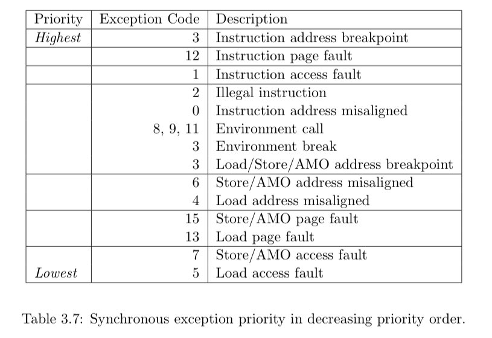

+++ 
draft = false
date = 2021-10-23T00:10:34-06:00
title = "Machine and Supervisor Cause CSRs"
slug = "2021-10-23-machine-and-supervisor-cause-csrs" 
tags = []
categories = []
+++

Today’s @risc_v Tip:

The `mcause` (M) / `scause` (S) CSRs indicate what type of exception caused a trap to the respective privilege level. A single instruction could cause multiple synchronous exceptions, in which case the register indicates event with the following priority:

[Original Tweet](https://twitter.com/hasheddan/status/1451976141275688960?s=20)