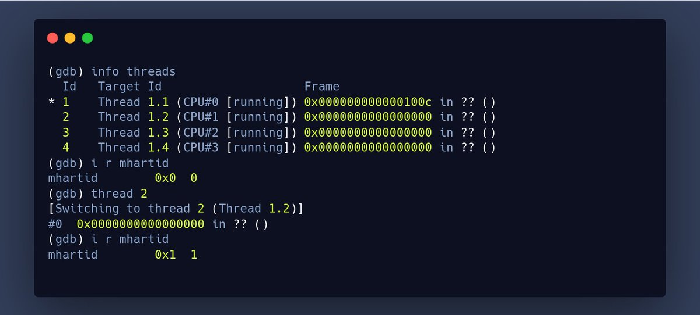

+++ 
draft = false
date = 2021-10-30T00:10:34-06:00
title = "View All Harts in GDB and mhartid"
slug = "2021-10-30-all-harts-gdb-and-mhartid" 
tags = []
categories = []
+++

Tonight's @risc_v Tip:

You can list all the harts on the platform you are debugging with gdb using `info threads`. Switching to another hart can be done with `thread <id>`. A quick way to check the current hart is to display the contents of the `mhartid` CSR.

[Original Tweet](https://twitter.com/hasheddan/status/1454609514188189700?s=20)