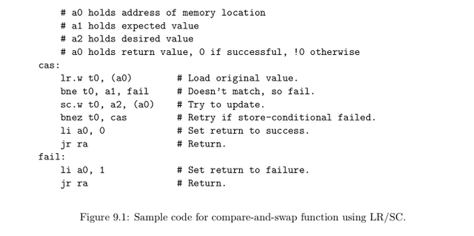
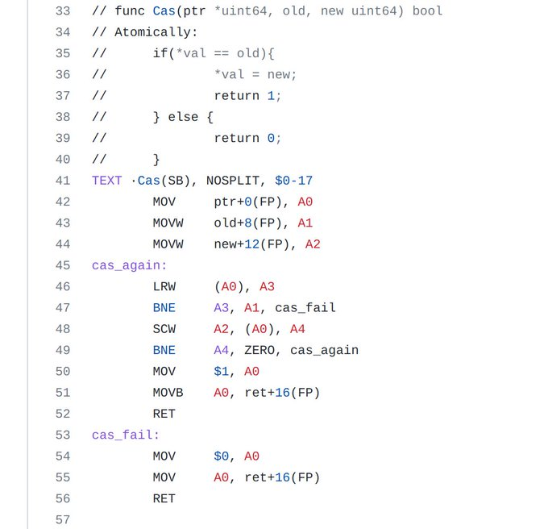
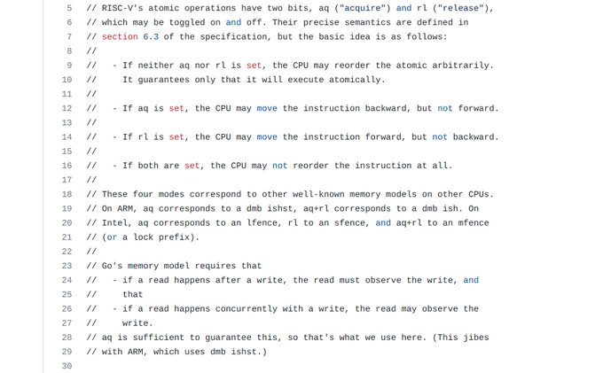
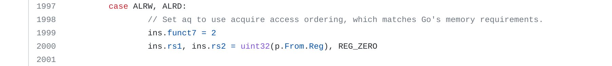

+++ 
draft = false
date = 2021-11-09T00:10:34-06:00
title = "Golang Compare and Swap Usage"
slug = "2021-11-09-golang-compare-and-swap" 
tags = []
categories = []
+++

Tonight's @risc_v Tip (feat. @golang):

Go uses a compare and swap (CAS) implementation similar to the example provided in the RISC-V unprivileged spec. The Go assembler always uses acquire access (`aq=1`) to align with the language's memory requirements.

---

---

---

[Original Tweet](https://twitter.com/hasheddan/status/1458269802720600065?s=20)