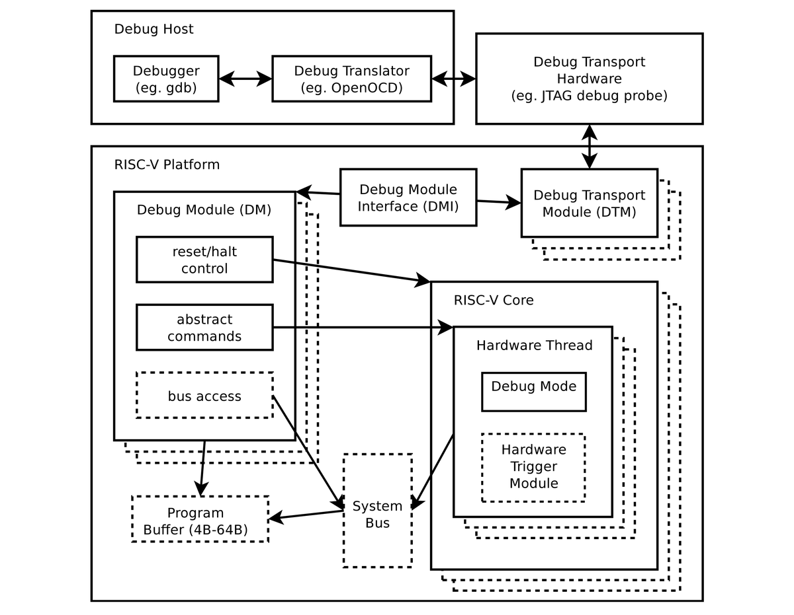

+++ 
draft = false
date = 2021-11-13T00:10:34-06:00
title = "Debug Spec Architecture"
slug = "2021-11-13-debug-spec-architecture" 
tags = []
categories = []
+++

Today's @risc_v Tip:

RISC-V has a separate debug spec that defines a Debug Module (DM), Debug Module Interface (DMI), Debug Transport Module (DTM), and Trigger Module (TM). The TM can be implemented independently of a DM, and adds support for setting native hardware breakpoints.

[Original Tweet](https://twitter.com/hasheddan/status/1459622171500814342?s=20)