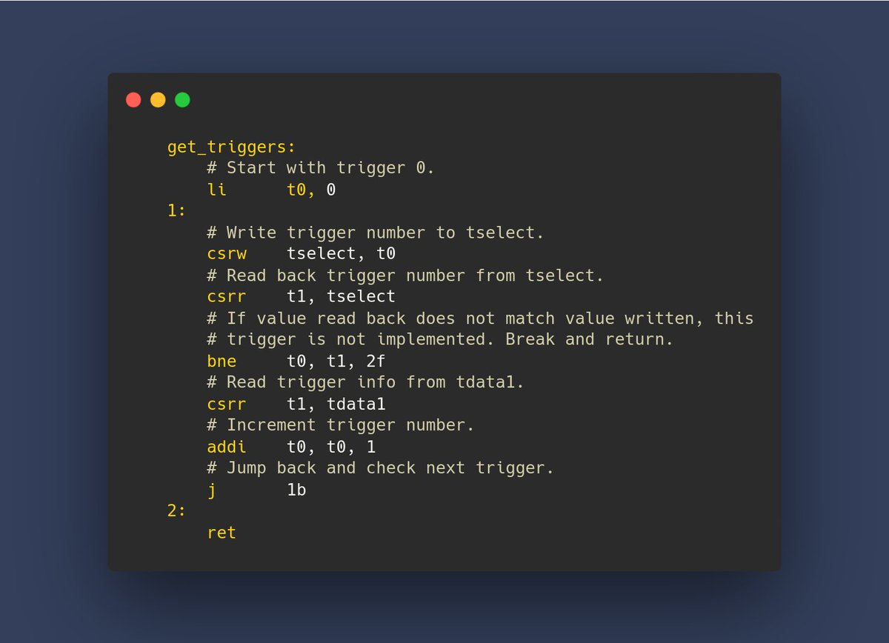

+++ 
draft = false
date = 2021-11-14T00:10:34-06:00
title = "Identifying Debug Triggers"
slug = "2021-11-14-identifying-debug-triggers" 
tags = []
categories = []
+++

Tonight's @risc_v Tip:

Continuing with the Trigger Module (TM), the RISC-V debug spec provides access to triggers via the `tselect` and `tdata1` / `tdata2` / `tdata3` CSRs. A list of supported triggers for a hart can be obtained by a sequence of write / read back operations.

[Original Tweet](https://twitter.com/hasheddan/status/1460031599580487681?s=20)