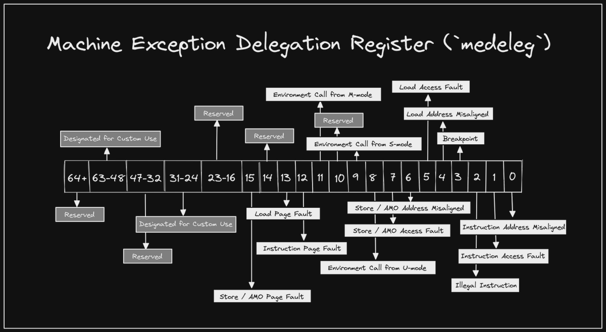

+++ 
draft = false
date = 2021-11-15T00:10:34-06:00
title = "Machine Exception Delegation Register"
slug = "2021-11-15-machine-exception-delegation-register" 
tags = []
categories = []
+++

Tonight's @risc_v Tip:

You might assume some exceptions, such as an `ecall` from User mode (U), are handled in Supervisor mode (S), but all traps are handled in Machine mode (M) by default. However, the `medeleg` CSR can be used to delegate some traps to a lower privilege level..

[Original Tweet](https://twitter.com/hasheddan/status/1460417769485254658?s=20)