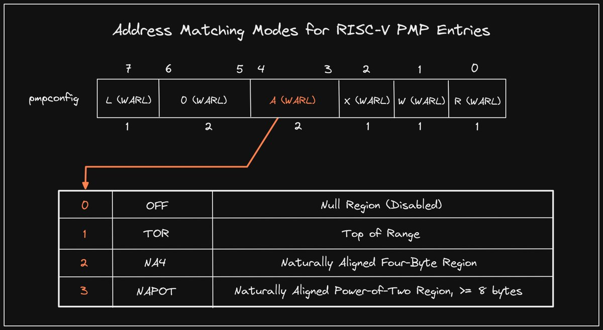

+++ 
draft = false
date = 2021-11-17T00:10:34-06:00
title = "Physical Memory Protection Address Matching Modes"
slug = "2021-11-17-pmp-address-matching" 
tags = []
categories = []
+++

Tonight's @risc_v Tip:

Yesterday we talked about the Physical Memory Protection (PMP) unit. PMP entries are defined with separate config and address CSRs. The 8-bit config CSR for an entry dedicates 2 bits (A) to defining the matching mode of its address CSR.

[Original Tweet](https://twitter.com/hasheddan/status/1461154746794921994?s=20)