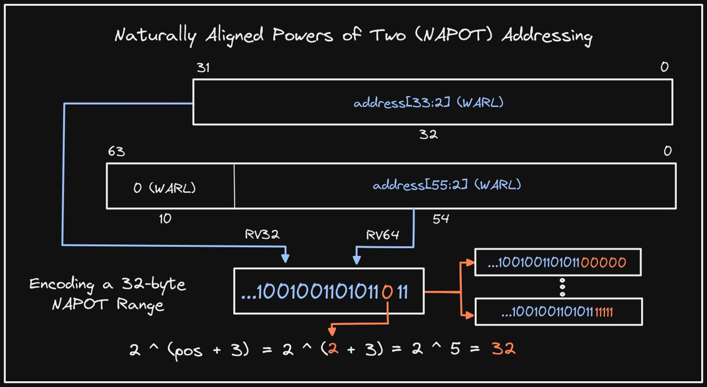

+++ 
draft = false
date = 2021-11-18T00:10:34-06:00
title = "PMP Addressing: Naturally Aligned Powers of Two"
slug = "2021-11-18-pmp-naturally-aligned-powers-of-two" 
tags = []
categories = []
+++

Tonight's @risc_v Tip:

Looking again at Physical Memory Protection (PMP) address matching modes, Naturally Aligned Powers of Two (NAPOT) addressing allows you to specify ranges with four-byte granularity by encoding the size in the low-order bits of the pmpaddr CSRs.

[Original Tweet](https://twitter.com/hasheddan/status/1461521842531979264?s=20)