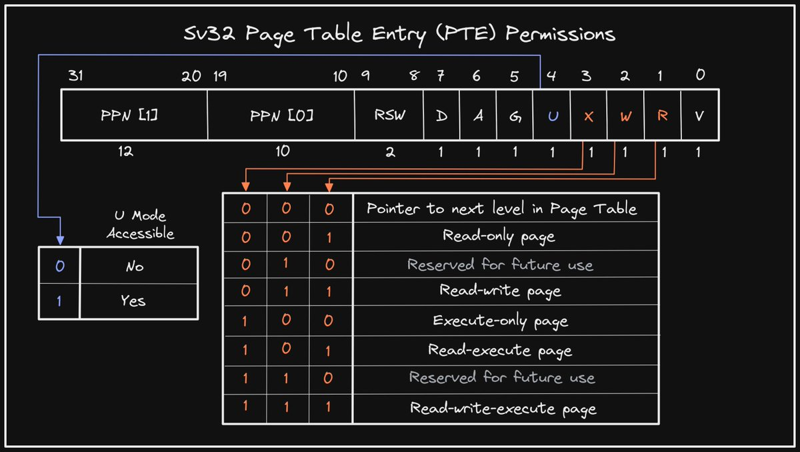

+++ 
draft = false
date = 2021-11-25T00:10:34-06:00
title = "Sv32 Page Table Entry Permissions"
slug = "2021-11-25-sv-32-pte-permissions" 
tags = []
categories = []
+++

Tonight's @risc_v Tip:

A 32-bit Page Table Entry (PTE) in Sv32 virtual memory mode contains four bits that indicate access permissions. The R, W, X bits correspond to Read, Write, and Execute access respectively. The U bit indicates whether the page is accessible in User (U) mode.

[Original Tweet](https://twitter.com/hasheddan/status/1463906931949641731?s=20)