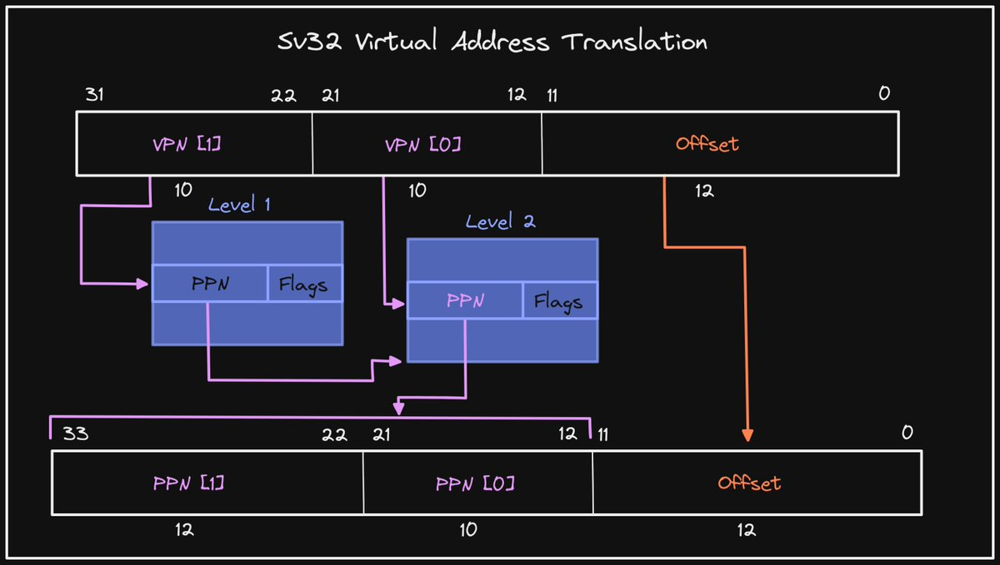

+++ 
draft = false
date = 2021-11-27T00:10:34-06:00
title = "Sv32 Two-Level Address Translation"
slug = "2021-11-27-sv-32-address-translation" 
tags = []
categories = []
+++

Tonight's @risc_v Tip:

Sv32 uses a two-level page table to enable virtual memory. A virtual address contains two Virtual Page Numbers (VPN) and an offset. The Physical Page Number (PPN) of the leaf Page Table Entry (PTE) is combined with the offset to form the physical address.

[Original Tweet](https://twitter.com/hasheddan/status/1464740814249238528?s=20)