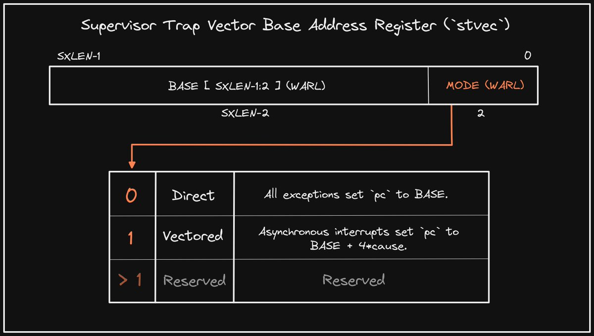

+++ 
draft = false
date = 2021-12-01T00:10:34-06:00
title = "Supervisor Trap Base Address Register"
slug = "2021-12-01-supervisor-trap-base-address" 
tags = []
categories = []
+++

Tonight's @risc_v Tip:

The Supervisor Trap Base Address CSR (`stvec`) indicates the location of the Supervisor (S) trap handler(s). The BASE address may be virtual or physical, and two modes are supported, with "Vectored" allowing for different handlers for each interrupt type.

[Original Tweet](https://twitter.com/hasheddan/status/1466212912914210819?s=20)