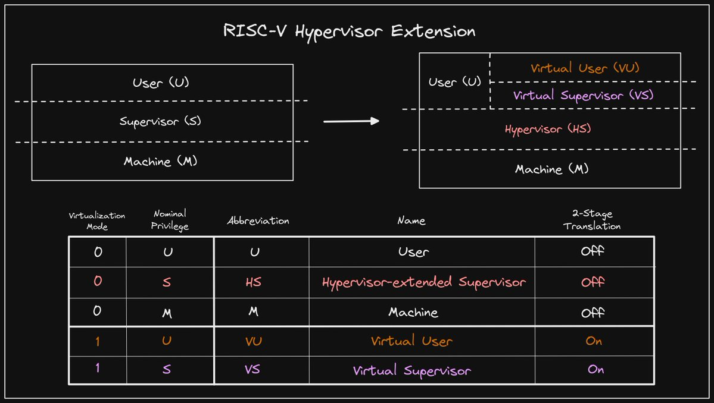

+++ 
draft = false
date = 2021-12-08T00:10:34-06:00
title = "The Hypervisor Extension"
slug = "2021-12-08-hypervisor extension" 
tags = []
categories = []
+++

Today's @risc_v Tip:

The RISC-V Hypervisor extension recently reached v1.0 and was ratified. Hypervisor (HS) mode extends Supervisor (S) mode with additional CSRs and instructions, allowing for two additional privilege levels: Virtual Supervisor (VS) and Virtual User (VU).

[Original Tweet](https://twitter.com/hasheddan/status/1468625503858802690?s=20)