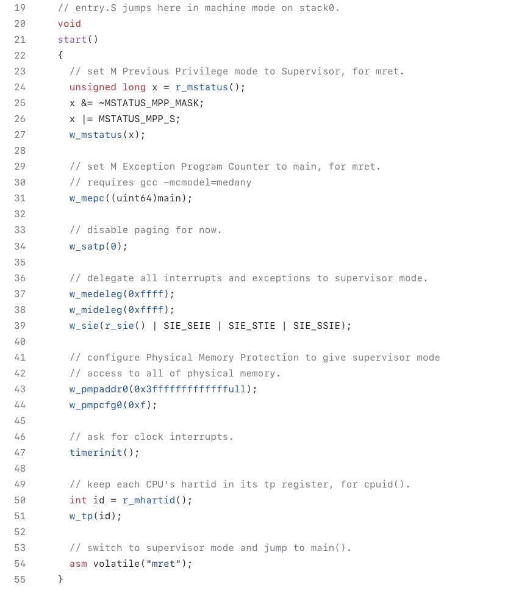

+++ 
draft = false
date = 2021-12-10T00:10:34-06:00
title = "xv6 Teaching Operating System"
slug = "2021-12-10-xv6-teaching-os" 
tags = []
categories = []
+++

Tonight’s @risc_v Tip:

MIT’s xv6 teaching OS is a great introduction to RISC-V. For example, start() contains most of the logic required to jump from Machine (M) mode to Supervisor (S) mode.

[Original Tweet](https://twitter.com/hasheddan/status/1469483310103605250?s=20)