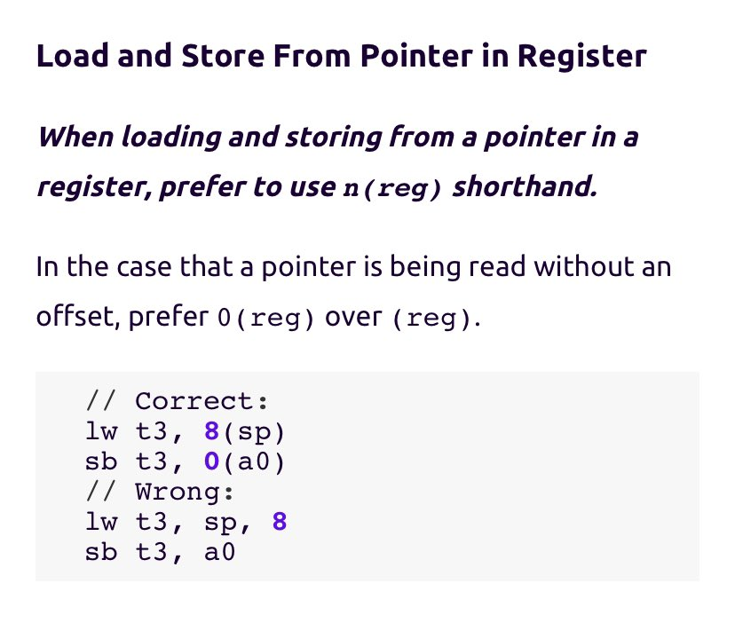

+++ 
draft = false
date = 2021-12-11T00:10:34-06:00
title = "OpenTitan Assembly Style Guide"
slug = "2021-12-11-opentitan-assembly-style-guide" 
tags = []
categories = []
+++

Today’s @risc_v Tip:

Today’s tip comes courtesy of the OpenTitan (a @lowRISC project) RISC-V assembly style guide. Using n(reg) offset syntax (even if n=0) when interacting with registers that are storing pointers makes it visually clear that the contents are a memory address.

[Original Tweet](https://twitter.com/hasheddan/status/1469707246909198341?s=20)