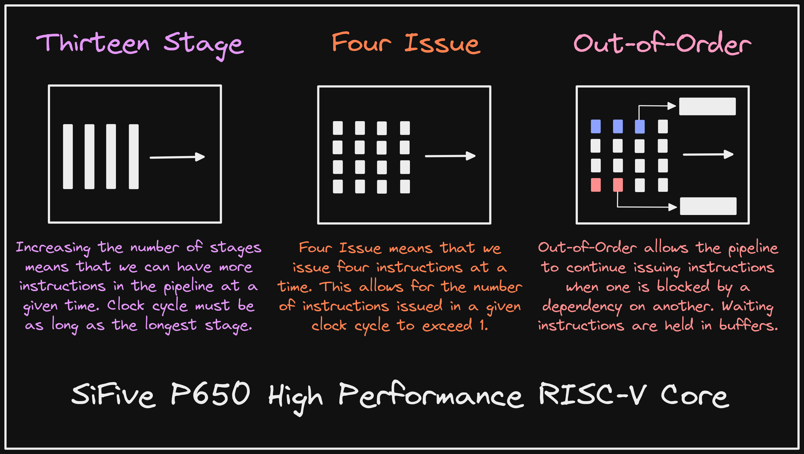

+++ 
draft = false
date = 2021-12-20T00:10:34-06:00
title = "SiFive P650"
slug = "2021-12-20-sifive-p650" 
tags = []
categories = []
+++

Tonight's @risc_vTip:

Understanding marketing material for processors can be confusing. @SiFive recently released its highest performance RISC-V processor: P650. Let's break down what it broadly means to be a "thirteen-stage, four-issue, out-of-order processor".

[Original Tweet](https://twitter.com/hasheddan/status/1473087417162870789?s=20)