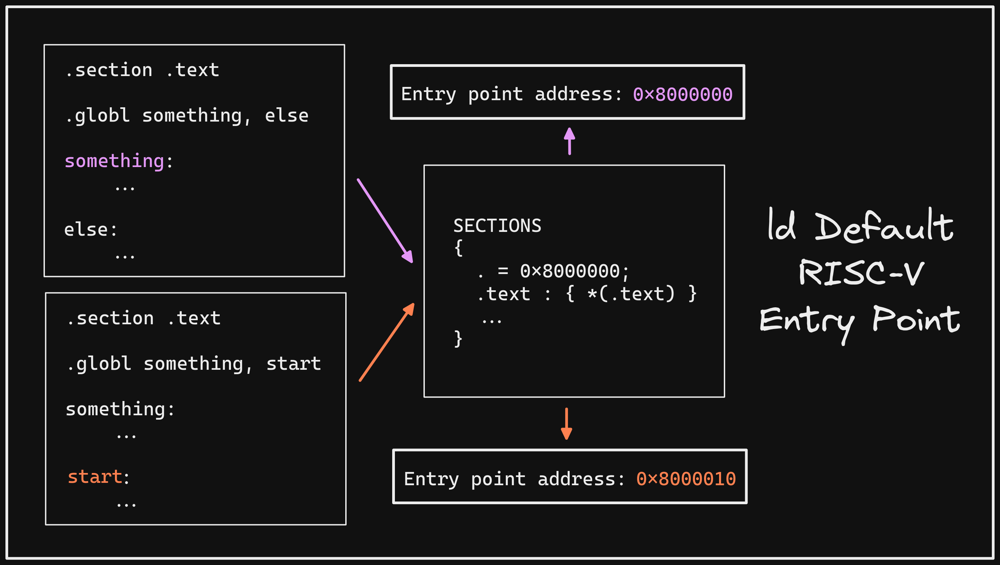

+++ 
draft = false
date = 2021-12-23T00:10:34-06:00
title = "ld Default Entry Point"
slug = "2021-12-23-ld-default-entry-point" 
tags = []
categories = []
+++

Today's @risc_v Tip:

If using `ld` as your linker, a global symbol defined as `start` will take precedence over earlier symbols in your `.text` section for program entry point when explicit `ENTRY` is not defined in your script or via `-e` flag on the command line.

[Original Tweet](https://twitter.com/hasheddan/status/1474038287408979980?s=20)