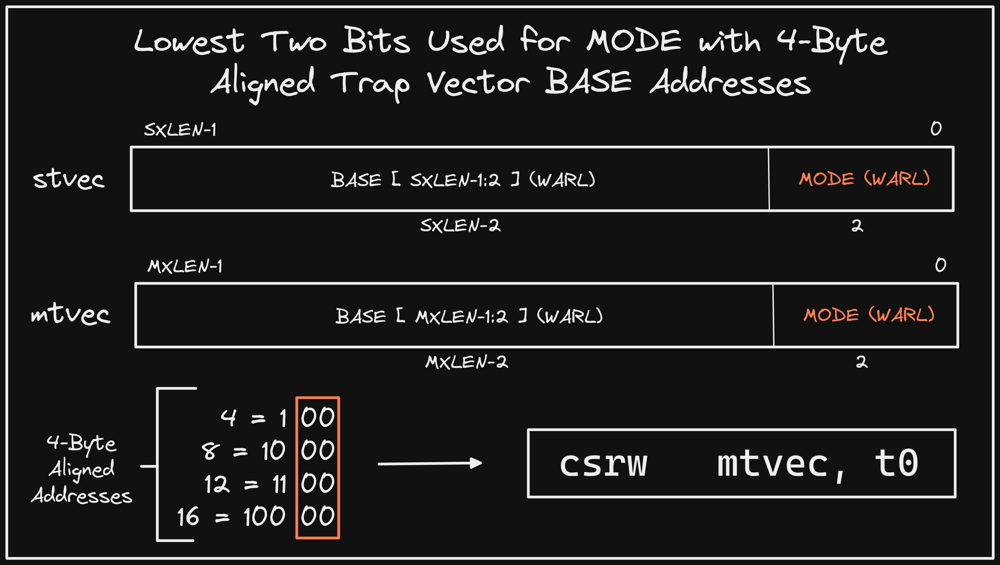

+++ 
draft = false
date = 2021-12-24T00:10:34-06:00
title = "4-Byte Aligned Trap Vectors"
slug = "2021-12-24-4-byte-aligned-trap-vectors" 
tags = []
categories = []
+++

Today's @risc_v Tip:

The trap vector BASE address CSRs (`mtvec` / `stvec`) can use the lowest two bits for MODE because the BASE address must be 4-byte aligned (i.e. lowest two bits = `00`). Note that a non-masked write of a valid address will overwrite MODE to Direct (`00`).

[Original Tweet](https://twitter.com/hasheddan/status/1474479216972468224?s=20)