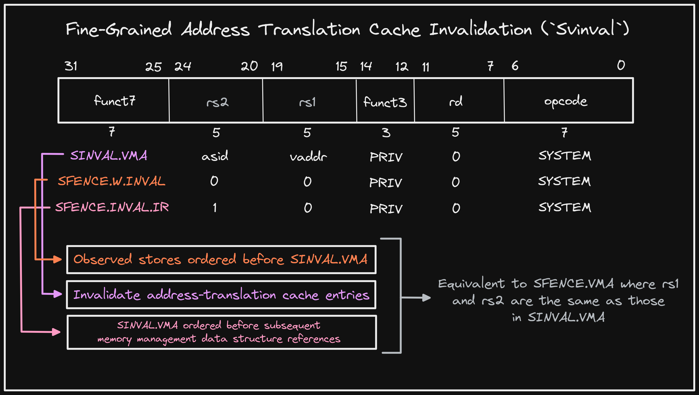

+++ 
draft = false
date = 2022-01-01T00:10:34-06:00
title = "Fine-Grained Address-Translation Cache Invalidation (Svinval)"
slug = "2022-01-01-fine-grained-address-translation-cache-invalidation" 
tags = []
categories = []
+++

First @risc_v Tip of 2022!

The final new extension added in the v1.12 Privileged Spec is "Fine-Grained Address-Translation Cache Invalidation" (`Svinval`). It breaks `SFENCE.VMA` into three distinct instructions, allowing for its operations to be more efficiently pipelined.

[Original Tweet](https://twitter.com/hasheddan/status/1477327825141174273?s=20)