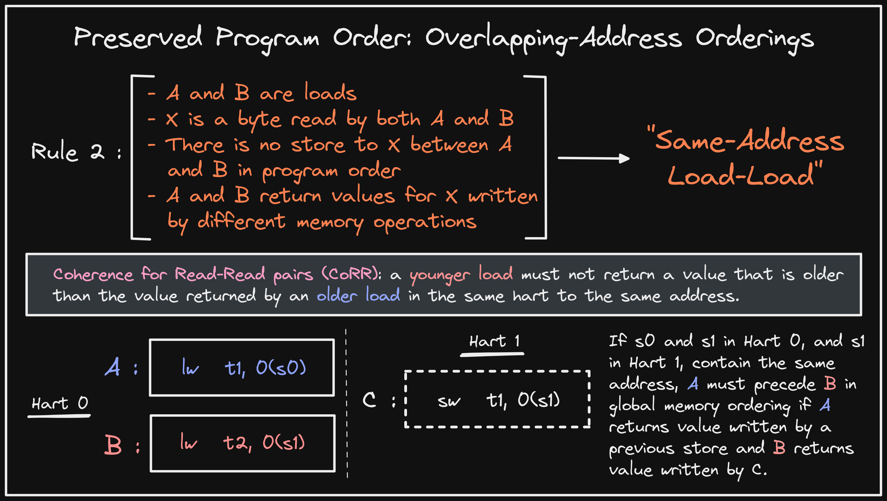

+++ 
draft = false
date = 2022-01-09T00:10:34-06:00
title = "RVWMO Preserved Program Order Rule 2"
slug = "2022-01-09-rvwmo-ppo-rule-2" 
tags = []
categories = []
+++

Today's @risc_v Tip:

The second PPO rule defines "Same-Address Load-Load" ordering. This rule serves to preserve "Coherence for Read-Read pairs" (CoRR), specifying that instructions in same hart reading same byte preserve order if return values were written by different mem ops.

[Original Tweet](https://twitter.com/hasheddan/status/1480221296973783040?s=20)