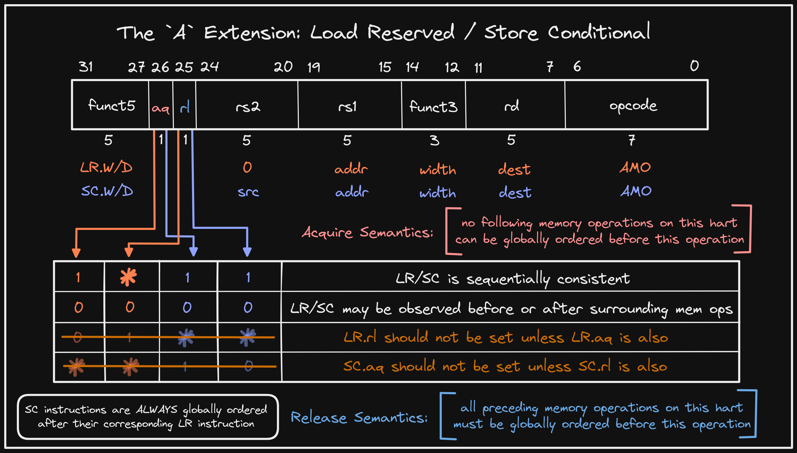

+++ 
draft = false
date = 2022-01-17T00:10:34-06:00
title = "Load-Reserved/Store-Conditional Release & Acquire Semantics"
slug = "2022-01-17-lr-sc-release-acquire" 
tags = []
categories = []
+++

Tonight's @risc_v Tip:

The `A` extension defines 2 types of instructions for atomic operations: load-reserved/store-conditional (LR/SC) and atomic fetch-and-op (AMO). Both support `acquire` and `release` bits to impose additional ordering semantics. LR/SC uses them as follows:

Note that `LR.rl` should not be set unless `http://LR.aq` is also, and `http://SC.aq` should not be set unless `SC.rl` is also. This is due to the fact that those arrangements would provide no additional ordering guarantees, but could impact performance.

[Original Tweet](https://twitter.com/hasheddan/status/1483117382914781187)